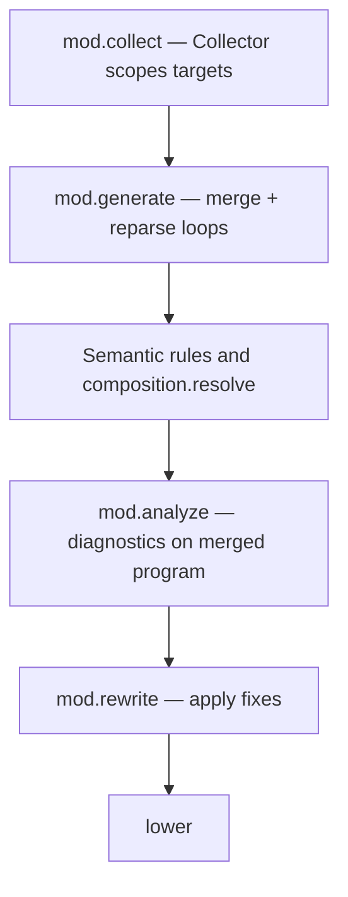

Mods insert **between parse and lowering**—after you have syntax, before you pretend Cranelift will save you.

## Author-facing order

From [Compiler Mod SDK — pipeline interaction](/docs/standard/language-meta/metaprogramming/compiler-mod-sdk/):

**Text equivalent:** The host collects Mod contracts and merges generated source. Semantic processing and composition resolution run next. The host then analyzes the merged program, applies approved rewrites, and lowering follows.

## Host modules (`beskid_analysis::mod_host`)

| Phase | Host concern |
| --- | --- |
| `discovery` / `load` | Find AOT artifacts, build schedule |
| `collect` | Narrow work per mod instance |
| `generate` / `merge` / `reparse` | Typed AST contributions |
| `analyze` | Run analyzers on merged snapshot |
| `rewrite` | Apply rewriter results |

Map: [Mod host bridge flow](/docs/standard/compiler/compiler-mods/mod-host-bridge/flow-and-algorithm/), [Crate-to-spec anchors](/docs/standard/compiler/implementation-map/crate-to-spec-anchors/).

## `beskid_pipeline`

Rust host composition shares **phase IDs** across CLI, analysis, and codegen services—avoid ad-hoc logging strings in random crates ([Pipeline composition](/docs/standard/compiler/pipeline-composition/), [Stage ordering](/docs/standard/compiler/build-pipeline/stage-ordering/)).

## IoC note

Dependency injection inside the Rust host is **compile-time** and read-only to mods/SDK—do not expect to register services from Beskid mod code.

## Where to go next

- Ship a mod: keep [Compiler Mod SDK](/docs/standard/language-meta/metaprogramming/compiler-mod-sdk/) open beside your editor.
- Debug pipeline: [14. From source to something that runs](/book/14-from-source-to-runs/)
- Change law: [12. The normative bible](/book/12-the-normative-bible/)
