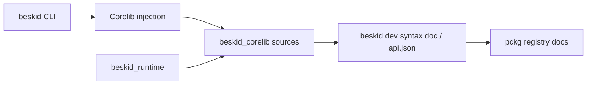

import { Aside } from '@astrojs/starlight/components';

<Aside type="caution">
This chapter is **informative**. Enforceable rules live under the [Platform specification](/platform-spec/).
</Aside>

The **corelib** package is not "stdlib.zip you found on a forum." The compiler **injects** it, the runtime backs part of it, and **pckg** serves the rest as normal, immutable package artifacts. Each `.bpk` carries its exact semver and registry dependency pins, while source `.bproj` files can keep workspace-local paths for development.

If you expected a monolithic `System.IO` graveyard, adjust expectations now.

## What you will find here

| Section | Topic |
| --- | --- |
| [corelib command](/book/16-corelib-batteries-with-opinions/corelib-command/) | Materialize the embedded template with `beskid dev build corelib`. |
| [Injection and resolution](/book/16-corelib-batteries-with-opinions/injection-and-resolution/) | How every project gets the same canonical package. |
| [Terminal and console](/book/16-corelib-batteries-with-opinions/terminal-and-console/) | ANSI, streams, and why console is not syscall soup. |
| [Doc and api.json](/book/16-corelib-batteries-with-opinions/doc-and-api-json/) | `beskid dev syntax doc`, structured API, and pckg docs UI. |
| [Runtime-backed surfaces](/book/16-corelib-batteries-with-opinions/runtime-backed-surfaces/) | What must call through the runtime vs pure Beskid. |

## Next

[17. Execution: ABI, host, and runtime](/book/17-execution-abi-host-runtime/)
