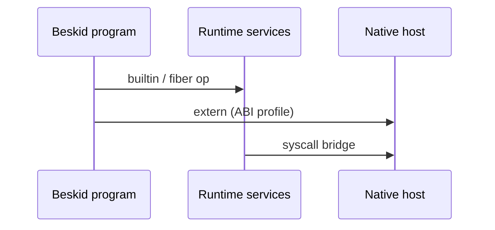

`beskid_abi` defines the contract between generated code and the runtime host. Version skew is not a vibe—it is a **compatibility** topic with normative text under [ABI versioning and compatibility](/platform-spec/execution/abi-and-host/abi-versioning-and-compatibility/).

Extern dispatch policy lives separately: [Extern dispatch and policy](/platform-spec/execution/abi-and-host/extern-dispatch-and-policy/). If you are wiring FFI, read chapter 21 *before* you `@extern` your way into a CVE write-up.

## Hub

[17. Execution](/book/17-execution-abi-host-runtime/)
