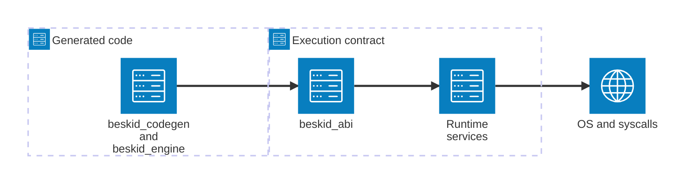

import { Aside } from '@astrojs/starlight/components';

<Aside type="caution">
This chapter is **informative**. Enforceable rules live under the [Platform specification](/platform-spec/).
</Aside>

Compilation is the part you can screenshot for LinkedIn. **Execution** is the part that actually runs—and panics, schedules fibers, and talks to the OS without asking your permission.

This chapter maps the [Execution](/platform-spec/execution/) domain to `beskid_abi`, `beskid_engine`, and the conformance evidence that keeps the reference platform honest.

## What you will find here

| Section | Topic |
| --- | --- |
| [Execution domain](/book/17-execution-abi-host-runtime/execution-domain/) | Domain map and where language law ends. |
| [ABI and host](/book/17-execution-abi-host-runtime/abi-and-host/) | Versioning, extern dispatch, host integration. |
| [Runtime fibers](/book/17-execution-abi-host-runtime/runtime-fibers/) | Scheduler, stacks, cooperative model. |
| [Panic, IO, syscalls](/book/17-execution-abi-host-runtime/panic-io-syscalls/) | Process termination, IO surfaces, syscall policy. |
| [Conformance evidence](/book/17-execution-abi-host-runtime/conformance-evidence/) | Tests and spec traceability. |

**Text equivalent:** Code produced by `beskid_codegen` and `beskid_engine` crosses the `beskid_abi` contract into runtime services, which call the operating system.

## Next

[18. Packages without npm trauma](/book/18-packages-without-npm-trauma/)
