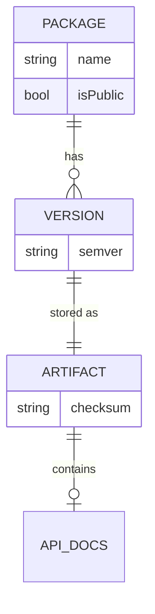

Every `.bpk` carries its exact semantic version in artifact-root `package.json`. `beskid pckg pack` selects that version from the package baseline or an explicit release plan; `beskid pckg upload` reads it from the artifact and sends it unchanged. The registry validates the version and refuses to replace different bytes at an existing package/version coordinate.

**Text equivalent:** A package has many versions. Each version is one immutable `.bpk` artifact, and a library artifact contains its generated `api.json` docs.

## What you declare vs what you get

| Package source / release plan owns | Registry / lockfile owns |
| --- | --- |
| Package id, targets, and the next artifact version | Immutable package/version storage |
| Source-workspace dependency paths | Exact registry dependency pins in the packed artifact and lockfile |

Source `.bproj` files may use local `path` dependencies while developing a workspace. A release packer must replace those in the artifact with exact `registry` dependencies from the coordinated publication plan; installed artifacts never depend on sibling checkout paths. Treat `Project.lock` as truth for consumer CI reproducibility—chapter 06 workspace material covers multi-project graphs.

## Spec

- [Package kinds](/docs/standard/tooling/registry-client/package-kinds/)
- [Project manifest contract](/docs/standard/tooling/manifests-and-lockfiles/project-manifest-contract/)
