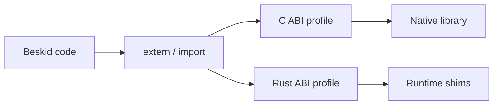

import { Aside } from '@astrojs/starlight/components';

<Aside type="caution">
This chapter is **informative**. Enforceable rules live under the [Platform specification](/platform-spec/).
</Aside>

FFI is where languages go to die. Beskid separates **language interop law** (language-meta) from **host dispatch** (execution ABI) so you know which spec page to argue about.

## What you will find here

| Section | Topic |
| --- | --- |
| [Interop overview](/book/21-ffi-and-forbidden-friendships/interop-overview/) | Domain map and profiles. |
| [FFI and extern](/book/21-ffi-and-forbidden-friendships/ffi-and-extern/) | `extern` and contract imports. |
| [C ABI profile](/book/21-ffi-and-forbidden-friendships/c-abi-profile/) | Link-time and dynamic resolution. |
| [Rust ABI profile](/book/21-ffi-and-forbidden-friendships/rust-abi-profile/) | Boundary stability (not "import any crate"). |
| [Export and callbacks](/book/21-ffi-and-forbidden-friendships/export-and-callbacks/) | Hosting Beskid from native code. |

## Next

[22. So you want to contribute](/book/22-so-you-want-to-contribute/)
