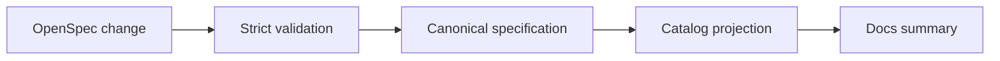

OpenSpec is the sole normative authority. Docs are informative and must not create a second requirement.

## Prerequisites

Describe the observable behavior that must change. Identify the stable capability identifier and existing requirements that the change affects.

## Actions

1. Create an OpenSpec change with a proposal, design when needed, tasks, and a capability delta.
2. Write each normative requirement with `SHALL or MUST`. Give every scenario `GIVEN, WHEN, and THEN` conditions.
3. Run `openspec validate <change-id> --strict --no-interactive` for the selected change.
4. Run `pnpm run openspec:validate` from the repository root.
5. Regenerate `openspec/catalog.json` only when the owning change requires the deterministic projection.

### Diagram text

| Stage | Result |
| --- | --- |
| OpenSpec change | The proposal identifies scope and the capability delta contains each proposed requirement. |
| Strict validation | Every `SHALL` or `MUST` rule and every `GIVEN`, `WHEN`, and `THEN` scenario passes validation. |
| Canonical specification | Accepted files under `openspec/specs/` become the normative source. |
| Catalog projection | `openspec/catalog.json` publishes stable identifiers and source relationships. |
| Docs summary | The informative Docs explain a task and link to the canonical requirement. |

## Expected result

Validation accepts complete `SHALL or MUST` requirements and `GIVEN, WHEN, and THEN` scenarios. The catalog keeps stable identifiers for the accepted source.

## Recovery

If strict validation reports a validation error, correct the OpenSpec change and run the focused command again; do not change Docs to hide a normative conflict. If a generated catalog differs unexpectedly, stop and inspect the source change and generator revision.

## Next task

[Write the public technical guidance](/docs/contributing/documentation/).
