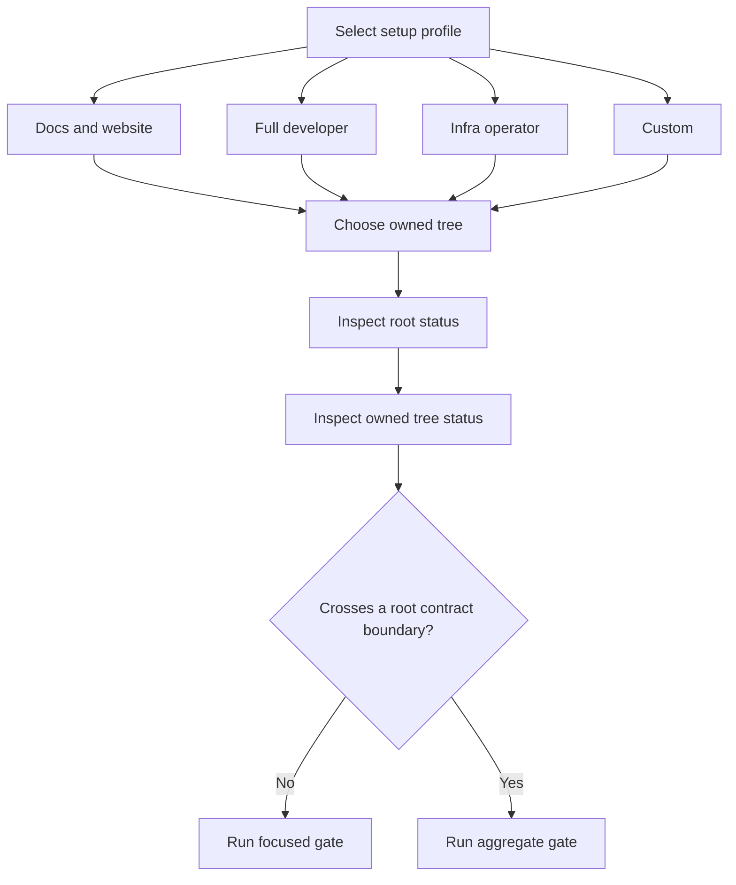

The superrepo records component revisions as gitlinks. A contributor owns only the root files and submodule trees assigned to the change.

## Prerequisites

Install Git and use a checkout with a clean ownership boundary. Confirm the root files or submodule tree that you own. Preserve all unrelated work.

| Setup profile | Intended scope |
| --- | --- |
| Docs and website | pnpm, `beskid_web_common`, and site configuration. |
| Full developer | The full toolchain and all submodules. |
| Infra operator | Operator tools and `beskid_infra`. |
| Custom | Explicit tool, submodule, and site choices. |

A focused gate means the smallest check that owns the changed component. An aggregate gate means a root check that verifies more than one component. A root contract boundary means an interface that coordinates multiple owned trees.

| Change scope | Gate command | Evidence |
| --- | --- | --- |
| Website Docs | `pnpm --dir site/website test` | Docs contracts and website behavior. |
| Shared web package behavior | `pnpm --dir beskid_web_common run test` | Shared package behavior. |
| Shared web package types | `pnpm --dir beskid_web_common run typecheck` | Shared package type contracts. |
| Learn lesson | `pnpm --dir site/learn run lesson:check 01-hello-beskid` | The selected example lesson. Replace the final argument with another known lesson identifier. |
| BSOL | `cargo test --workspace` from `beskid_bsol/` | BSOL workspace behavior. |
| Tree-sitter | `bunx tree-sitter test` from `beskid_treesitter/` | Parser corpus behavior. |
| First-party templates | `bash scripts/ci/corelib-publish.sh --dry-run` | All template artifacts without a registry write. |
| Root web type boundary | `pnpm typecheck` | Coordinated web types. |
| Full local integration | `./validate-ci-local.sh` | Aggregate root integration contracts. |

The status command below uses `beskid_web_common` as an executable example. Substitute the directory of the actual owned submodule before you run the command. Other owned submodule directories include `beskid_bsol`, `beskid_treesitter`, `beskid_templates`, and `beskid_infra`. The same status check applies to every selected submodule, but the example does not assign ownership.

## Actions

1. Run `just setup` from the superrepo root.
2. Select one setup profile in the wizard.
3. Select the owned tree for the planned change.
4. Inspect root status with `git status --short`.
5. Inspect the selected owned submodule with the applicable form of `git -C beskid_web_common status --short`.
6. Run the focused gate from the gate table for the owned component.
7. Run the aggregate gate from the gate table when the change crosses a root contract boundary.

The workflow has a branch for setup scope and a branch for gate scope.

### Diagram text

- A setup profile is Docs and website, Full developer, Infra operator, or Custom.
- The contributor chooses the owned tree after setup initializes the required submodules.
- The root status and owned tree status expose unrelated dirty state before a change.
- A focused gate checks a change inside one ownership boundary.
- An aggregate gate checks a change that crosses a root contract boundary.

## Expected result

The selected tools and submodules are ready. The owned tree stays at the pinned gitlinks until its owner makes an intentional revision change. The selected gate reports the component or aggregate contract that it checked.

## Recovery

If any status shows unrelated dirty state, stop and preserve it. You do not reset, stage, or commit another owner's files. If a gitlink changes without an owned submodule commit, contact the submodule owner.

## Next task

[Change Learn curriculum](/docs/contributing/learn-curriculum/) for a lesson, or [write Beskid documentation](/docs/contributing/documentation/) for public guidance.
