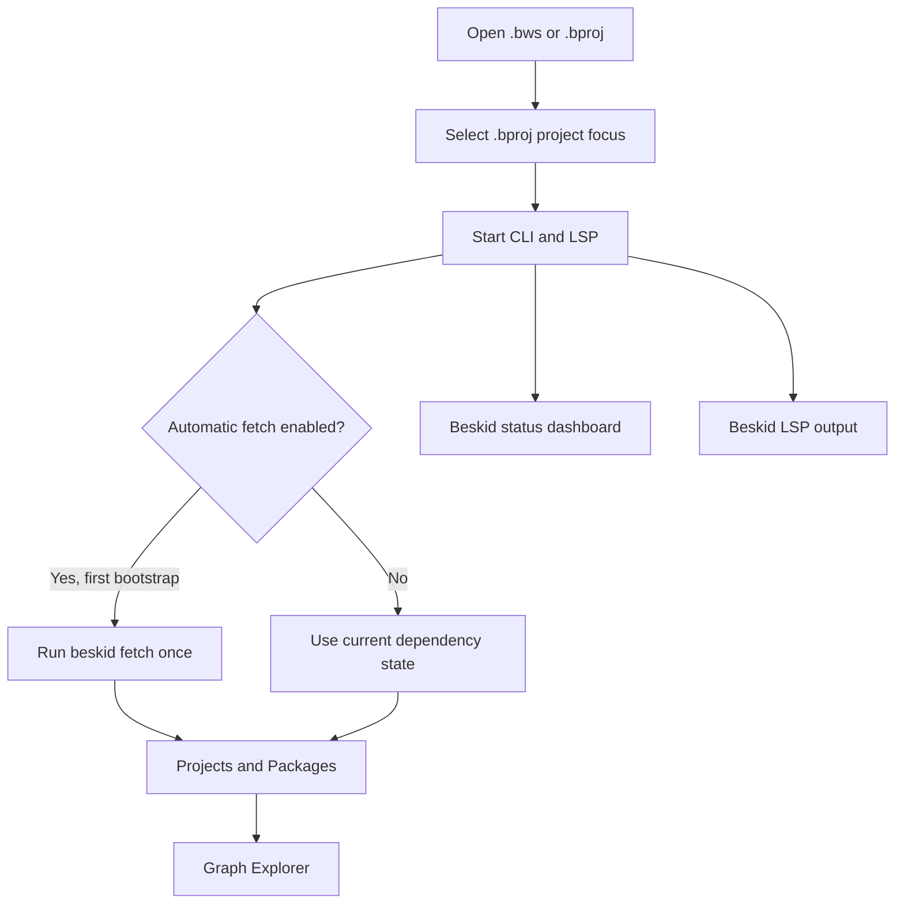

A `.bws` manifest is a workspace container. Select one member `.bproj` manifest as the focused project for diagnostics, package actions, and project graphs. This UI behavior is informative. The Beskid Standard remains normative.

## Prerequisites

Complete [the first installation](/docs/getting-started/editor/) and keep the installed extension active. Open a folder that contains a `.bws` or `.bproj` manifest.

## Actions

1. Open **Projects** from the Beskid activity bar.
2. Select one member `.bproj` entry under a `.bws` workspace, or select one standalone `.bproj` entry. This selection sets the focused project.
3. Keep the default `beskid.project.autoSelectFromEditor` setting enabled if editor changes must select the nearest project.
4. Select the Beskid status-bar entry. This action opens the Status dashboard in the bottom panel and shows project, CLI, language-server, and recovery state.
5. Keep `beskid.toolchain.autoFetchDependencies` enabled if the first toolchain bootstrap must run `beskid fetch` once. The fetch does not run on each extension launch.
6. Inspect `Project.lock` after any automatic or manual fetch.
7. Expand **Projects** to inspect workspace members, targets, dependencies, and source folders.
8. Run **Beskid: Select Project** when automatic focus selects the wrong `.bproj` file.
9. Open **Packages** to inspect the focused project's declared and locked dependencies.
10. Select **Browse registry** to read the public catalogue.
11. Run **Beskid: Fetch Packages** after a dependency change.
12. Configure private package access with **Beskid: Configure Package Registry API Key**. This command stores the value in VS Code SecretStorage.
13. Do not put a key in `beskid.pckg.apiKey`. That setting can keep the key as plain-text configuration and takes priority over SecretStorage.
14. Open **Graph Explorer** with **Beskid: Show Project Graph**. The command uses the focused `.bproj` project.
15. Use a `.bws` manifest only with **Beskid: Show Workspace Graph**.

### Diagram text

Open a folder that contains a `.bws` workspace or a `.bproj` project. Select a `.bproj` project focus before you use project-scoped tools. The extension starts the CLI and language server. During the first bootstrap, automatic fetch runs `beskid fetch` once when you enable it. When you disable automatic fetch, the extension uses the current dependency state. Projects and Packages then show information for the selected context. Graph Explorer requests a graph for that context. The Beskid status dashboard shows the current lifecycle state. The Beskid LSP output records startup, fetch, and language-server details.

## Expected result

VS Code shows one focused `.bproj` project. Projects, Packages, and Graph Explorer use that project context. `Project.lock` records the dependency resolution that you reviewed.

## Recovery

Open the Beskid LSP output channel when setup, fetch, or language-server work fails. Run **Beskid: Setup Toolchain** to retry CLI and LSP setup. Run **Beskid: Fetch Packages** to retry dependency fetch for the focused project, and inspect `Project.lock` again. If the graph rejects the context, focus a `.bproj` project for project graphs or open a `.bws` manifest for the workspace graph.

## Next task

Continue with [Projects](/docs/projects/) or [Packages](/docs/packages/) for the matching CLI and manifest procedures.
