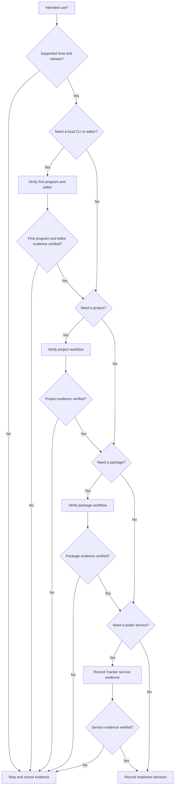

Use this task to make a readiness decision. Record facts from the linked sources. Do not infer support from an unverified feature or release label.

## Prerequisites

State your intended use. Use a supported host: Linux on AMD64, macOS on ARM64, or Windows on AMD64. Prepare a record for links, release tags, command output, and open questions.

## Actions

1. Record the intended use that you need to evaluate, such as a local program, a project, a package, or a public service.
2. Confirm that [Downloads](/downloads/) lists an artifact for your supported host.
3. Record the displayed release channel or immutable tag without treating either label as a maturity promise.
4. If your intended use needs a local CLI or editor, record the results from [Write and run a program](/docs/getting-started/first-program/) and [Connect VS Code](/docs/getting-started/editor/).
5. If your intended use needs a project, record whether the manifest and lock workflow in [Projects](/docs/projects/) fits.
6. If your intended use needs a package, record whether the workflow and recovery limits in [Packages](/docs/packages/) fit.
7. Only when your intended use needs a public service, record the date and related issue or version from [Tracker](https://tracker.beskid-lang.org).
8. Record the exact [Beskid Standard](/docs/standard/) capability or requirement for each required behavior.

The decision flow stops the evaluation when any required evidence is missing.

### Diagram text

1. Start with the intended use and a supported host with a listed release.
2. Verify the first program and editor only when the intended use needs local CLI or editor work. Stop if the evidence is missing.
3. Verify project and package work only when the intended use needs each workflow. Stop if either selected evidence check is missing.
4. Record service evidence from Tracker only when the intended use depends on a public service. A local-only evaluation does not need service evidence. Stop if selected service evidence is missing.
5. Compare behavior with the Standard and record the linked requirement.
6. When any selected evidence check has no verified result, stop and record the missing evidence instead of inferring readiness.

## Expected result

You have an evidence record for the supported host, release, Standard links, and each workflow that applies to the intended use. The record states a readiness decision or an unresolved stop condition.

## Recovery

Stop the evaluation when Downloads does not list the host artifact or an evidence check selected by the intended use fails. When the intended use needs a public service, stop if required Tracker evidence is absent. When a required result is absent, do not infer release maturity, service availability, or language behavior. Keep the recorded evidence and return to the failed task or the linked authority.

## Next task

Open [Install Beskid](/docs/getting-started/install/) when the readiness decision supports a local evaluation. Open [Learn Beskid](/docs/learn/) for browser lessons before you install a toolchain.
