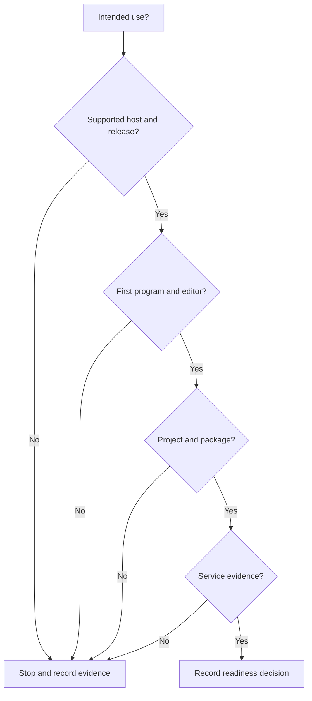

Use this task to make a readiness decision. Record facts from the linked sources. Do not infer support from an unverified feature or release label.

## Prerequisites

State your intended use. Use a supported host: Linux on AMD64, macOS on ARM64, or Windows on AMD64. Prepare a record for links, release tags, command output, and open questions.

## Actions

1. Record the intended use that you need to evaluate, such as a local program, a project, a package, or a public service.
2. Open [Downloads](/downloads/) and confirm that it lists an artifact for your supported host.
3. Record the displayed release channel or immutable tag. Do not treat either label as a maturity promise.
4. Complete [Write and run a program](/docs/getting-started/first-program/) and record its analysis and process result.
5. Complete [Connect VS Code](/docs/getting-started/editor/) and record whether the Problems panel shows and clears a diagnostic.
6. Read [Projects](/docs/projects/) and record whether the documented manifest and lock workflow fits your intended use.
7. Read [Packages](/docs/packages/) and record whether the package workflow and recovery limits fit your intended use.
8. Check [Tracker](https://tracker.beskid-lang.org) for delivery status and record the date with the related issue or version link.
9. Compare required language behavior with the [Beskid Standard](/docs/standard/) and record the exact capability or requirement link.

### Diagram text

1. Start with the intended use and a supported host with a listed release.
2. Verify the first program and editor before you assess project and package work.
3. Record service evidence from Tracker when your intended use depends on a public service.
4. Compare behavior with the Standard and record the linked requirement.
5. Use this stop condition when a required check has no verified result. Record the missing evidence instead of inferring readiness.

## Expected result

You have an evidence record for the supported host, release, first program, editor, project, package, service evidence, and Standard links. The record states a readiness decision or an unresolved stop condition.

## Recovery

Stop the evaluation when Downloads does not list the host artifact, a task check fails, or required Tracker evidence is absent. When a required result is absent, do not infer release maturity, service availability, or language behavior. Keep the recorded evidence and return to the failed task or the linked authority.

## Next task

Open [Install Beskid](/docs/getting-started/install/) when the readiness decision supports a local evaluation. Open [Learn Beskid](/docs/learn/) for browser lessons before you install a toolchain.
