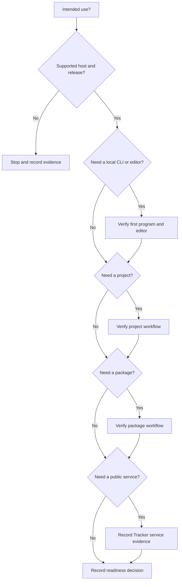

Use this task to make a readiness decision. Record facts from the linked sources. Do not infer support from an unverified feature or release label.

## Prerequisites

State your intended use. Use a supported host: Linux on AMD64, macOS on ARM64, or Windows on AMD64. Prepare a record for links, release tags, command output, and open questions.

## Actions

1. Record the intended use that you need to evaluate, such as a local program, a project, a package, or a public service.
2. Open [Downloads](/downloads/) and confirm that it lists an artifact for your supported host.
3. Record the displayed release channel or immutable tag. Do not treat either label as a maturity promise.
4. If your intended use needs a local CLI or editor, complete [Write and run a program](/docs/getting-started/first-program/) and [Connect VS Code](/docs/getting-started/editor/). Record the results.
5. If your intended use needs a project, read [Projects](/docs/projects/) and record whether the manifest and lock workflow fits.
6. If your intended use needs a package, read [Packages](/docs/packages/) and record whether the package workflow and recovery limits fit.
7. Only when your intended use needs a public service, check [Tracker](https://tracker.beskid-lang.org) for delivery status and record the date with the related issue or version link.
9. Compare required language behavior with the [Beskid Standard](/docs/standard/) and record the exact capability or requirement link.

### Diagram text

1. Start with the intended use and a supported host with a listed release.
2. Verify the first program and editor only when the intended use needs local CLI or editor work.
3. Verify project and package work only when the intended use needs each workflow.
4. Record service evidence from Tracker only when the intended use depends on a public service. A local-only evaluation does not need service evidence.
5. Compare behavior with the Standard and record the linked requirement.
6. Use this stop condition when a required check has no verified result. Record the missing evidence instead of inferring readiness.

## Expected result

You have an evidence record for the supported host, release, Standard links, and each workflow that applies to the intended use. The record states a readiness decision or an unresolved stop condition.

## Recovery

Stop the evaluation when Downloads does not list the host artifact or an evidence check selected by the intended use fails. When the intended use needs a public service, stop if required Tracker evidence is absent. When a required result is absent, do not infer release maturity, service availability, or language behavior. Keep the recorded evidence and return to the failed task or the linked authority.

## Next task

Open [Install Beskid](/docs/getting-started/install/) when the readiness decision supports a local evaluation. Open [Learn Beskid](/docs/learn/) for browser lessons before you install a toolchain.
