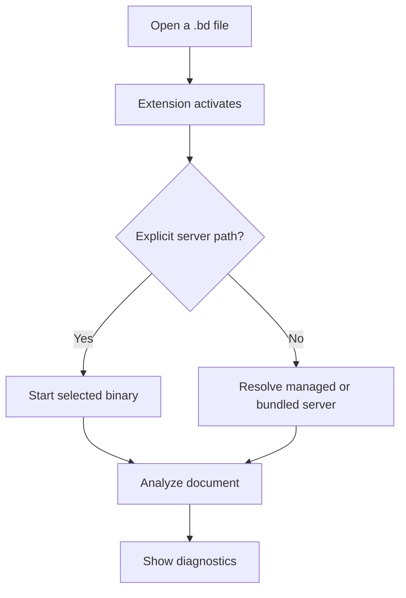

The extension selects one language server. An explicit `beskid.lsp.server.path` has priority. Without that setting, the extension checks managed, preferred bundled, and CLI-backed servers before workspace fallbacks.

## Prerequisites

Install VS Code and complete [Install Beskid](/docs/getting-started/install/). Keep the `Main.bd` file from the first-program task.

## Actions

1. Install the stable extension from Open VSX:

   ```bash
   code --install-extension beskid.beskid-vscode
   ```

2. Open the directory that contains `Main.bd` in VS Code.
3. Leave `beskid.lsp.server.path` empty to use automatic selection. The extension tries a managed binary, a bundled binary, the CLI `lsp` command, and supported workspace fallbacks.
4. To select a specific server, set `beskid.lsp.server.path` to the absolute path of `beskid_lsp` or `beskid_lsp.exe`.
5. Save `Main.bd` and inspect the Problems panel.
6. Change `return 0;` to `return missingValue;`, save the file, and confirm that a diagnostic appears. Restore `return 0;` and save again.



### Diagram text

1. Opening a `.bd` file activates the extension.
2. An explicit server path selects that binary. Otherwise, the extension resolves an installed or bundled server.
3. The server analyzes the document and sends diagnostics to VS Code.

## Expected result

The Problems panel shows a diagnostic after the invalid edit and clears it after you restore `Main`. Only one selected language-server process supplies the document diagnostics.

## Recovery

If the extension cannot start a server, run **Beskid: Install LSP** or repeat `beskid lsp install --release-tag lsp-stable`. If multiple installations cause ambiguity, set the absolute `beskid.lsp.server.path`. Use the extension output channel to find the selected command and path.

## Next task

Use [first-day troubleshooting](/docs/getting-started/troubleshooting/) if a check still fails. Otherwise, continue to [Tooling](/docs/tooling/).
