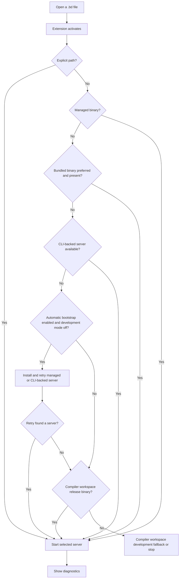

This first installation task connects one language server and verifies diagnostics. An explicit `beskid.lsp.server.path` has priority. Without it, the extension checks each fallback in a fixed order.

## Prerequisites

Install VS Code and complete [Install Beskid](/docs/getting-started/install/). Keep the `Main.bd` file from the first-program task.

## Actions

1. Install the stable extension from Open VSX:

   ```bash
   code --install-extension beskid.beskid-vscode
   ```

2. Open the directory that contains `Main.bd` in VS Code.
3. Leave `beskid.lsp.server.path` empty to use automatic selection. The extension checks a managed binary first. It then checks a preferred bundled binary and a CLI-backed server.
4. To select a specific server, set `beskid.lsp.server.path` to the absolute path of `beskid_lsp` or `beskid_lsp.exe`.
5. Save `Main.bd` and inspect the Problems panel.
6. Change `return 0;` to `return missingValue;`, save the file, and confirm that a diagnostic appears. Restore `return 0;` and save again.



### Diagram text

1. Opening a `.bd` file activates the extension. An explicit path selects that server.
2. Without an explicit path, the extension checks the managed binary and then the preferred bundled binary.
3. Next, it checks for a CLI-backed server. When development mode is off, enabled automatic bootstrap can install a toolchain. It then retries the managed and CLI-backed paths.
4. A compiler-workspace release binary is the next fallback. The compiler-workspace fallback can then use configured development mode. These paths apply only when their required workspace or development configuration exists.
5. The selected server analyzes the document and sends diagnostics to VS Code. If no supported path applies, selection stops with an actionable error.

## Expected result

The Problems panel shows a diagnostic after the invalid edit and clears it after you restore `Main`. Only one selected language-server process supplies the document diagnostics.

## Recovery

If the extension cannot start a server, run **Beskid: Install LSP** or repeat `beskid lsp install --release-tag <selected-lsp-tag>`. Use the LSP tag that corresponds to the selected CLI channel or immutable version. See [Install Beskid](/docs/getting-started/install/) for the matching tags. If multiple installations cause ambiguity, set the absolute `beskid.lsp.server.path`. Use the extension output channel to find the selected command and path.

## Next task

Use [first-day troubleshooting](/docs/getting-started/troubleshooting/) if a check still fails. After the first installation succeeds, continue to the [daily VS Code project workflow](/docs/editor/vs-code/).
