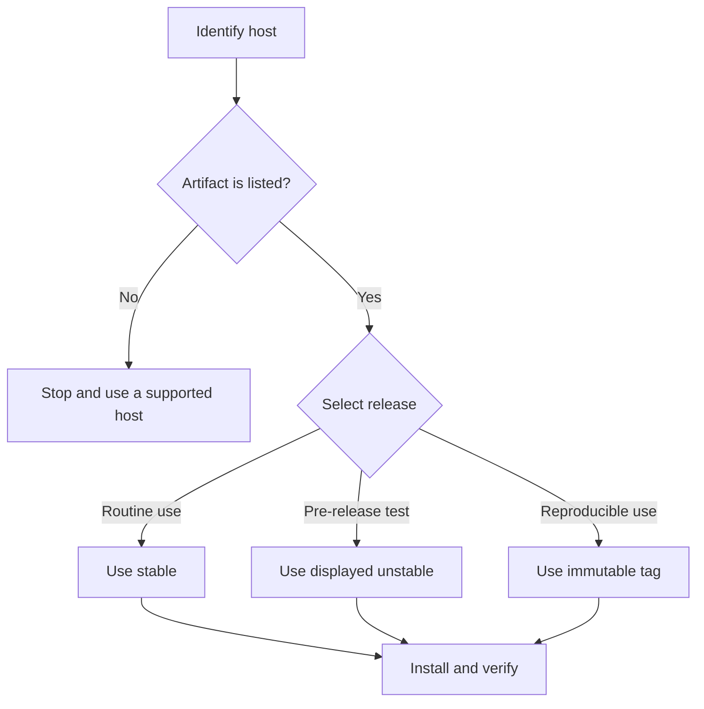

The stable channel changes only when a release is promoted. The unstable channel follows verified development delivery. Use an immutable `cli-vX.Y.Z` tag when a build must not move to a newer version.

## Prerequisites

Confirm that your host is Linux AMD64, macOS ARM64, or Windows AMD64. Close terminals that use an older Beskid installation.

## Actions

1. Open [Downloads](/downloads/).
2. Select your exact operating system and architecture.
3. Read the displayed release channel. Use stable for routine work. Treat unstable as a pre-release build.
4. Use only an install command or package that the page displays. The direct installer places the CLI at `~/.beskid/bin/beskid` on Linux and macOS, or `%USERPROFILE%\.beskid\bin\beskid.exe` on Windows.
5. Open a new terminal so that the updated `PATH` takes effect.
6. Run the checks:

   ```bash
   beskid --version
   beskid --help
   beskid up host-target
   ```

7. Install the stable language server. Replace `lsp-stable` with an immutable `lsp-vX.Y.Z` tag when you must pin it.

   ```bash
   beskid lsp install --release-tag lsp-stable
   ```

8. To pin a direct installation, replace the example version with the immutable tag that Downloads displays:

   ```bash
   curl -fsSL https://beskid-lang.org/install.sh | BESKID_RELEASE_TAG=cli-v0.4.0 bash
   ```

   On Windows PowerShell, set `$env:BESKID_RELEASE_TAG` to the same tag before you run the displayed PowerShell installer.

9. To upgrade, repeat the Downloads install command for the channel or immutable tag that you need.



### Diagram text

1. Match the host to an artifact that the Downloads page lists.
2. Confirm whether Downloads shows stable or unstable. Use an immutable tag for reproducibility.
3. Install the artifact, open a new terminal, and verify the CLI.
4. Install the language server separately with `beskid lsp install`.

## Expected result

The CLI prints one version, its help lists root commands such as `analyze`, `format`, `run`, `test`, and `build`, and `beskid up host-target` prints the detected target triple. The LSP install command exits successfully.

## Recovery

If the shell cannot find `beskid`, open a new terminal and put the user-local Beskid `bin` directory before older installs on `PATH`. If the host target does not match the selected artifact, remove that artifact and install the matching one. If an LSP download fails, keep the CLI installation and retry the LSP command with a listed release tag.

For a direct CLI uninstall on Linux or macOS, run `rm -f ~/.beskid/bin/beskid`. On Windows PowerShell, run `Remove-Item "$env:USERPROFILE\.beskid\bin\beskid.exe"`. Use the operating-system package manager to remove a package installer.

## Next task

[Write and run a first program](/docs/getting-started/first-program/).
