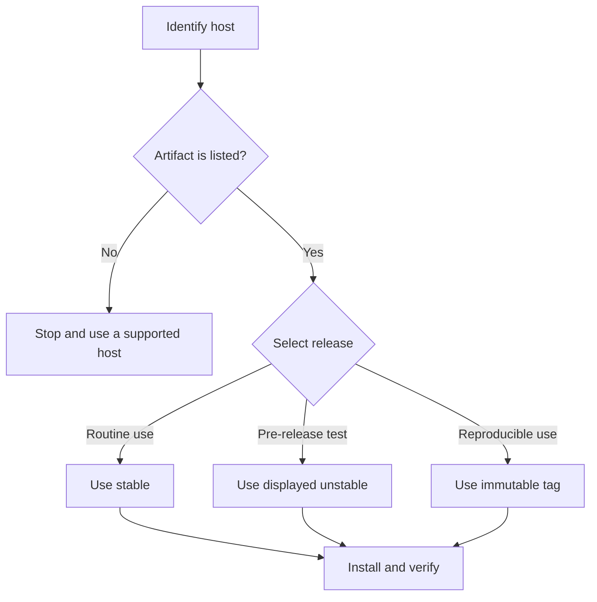

The stable channel changes only after maintainers promote a release. The unstable channel follows verified development delivery. Use an immutable `cli-vX.Y.Z` tag when a build must not move to a newer version.

## Prerequisites

Confirm that your host is Linux AMD64, macOS ARM64, or Windows AMD64. Close terminals that use an older Beskid installation.

## Actions

1. Open [Downloads](/downloads/).
2. Select your exact operating system and architecture.
3. Read the displayed release channel. Use stable for routine work. Treat unstable as a pre-release build.
4. Use only an install command or package that the page displays. The direct installer puts the CLI at `~/.beskid/bin/beskid` on Linux and macOS. It uses `%USERPROFILE%\.beskid\bin\beskid.exe` on Windows.
5. On Linux or macOS, the POSIX installer only prints a `PATH` instruction. Add this line to the relevant shell profile. You can also run it in the current shell:

   ```bash
   export PATH="$HOME/.beskid/bin:$PATH"
   ```

6. The Windows installer adds `%USERPROFILE%\.beskid\bin` to the user `PATH`. Restart the terminal after the installer finishes.
7. Reload the updated shell profile or open a new terminal on Linux and macOS.
8. Run the checks:

   ```bash
   beskid --version
   beskid --help
   beskid up host-target
   ```

9. Match the language-server channel to the CLI channel:

   | CLI release | LSP release |
   | --- | --- |
   | `cli-stable` | `lsp-stable` |
   | `cli-unstable` | `lsp-unstable` |
   | `cli-v0.4.0` | `lsp-v0.4.0` |

   The matching tags identify a common source version only. They do not guarantee binary compatibility.

10. Install the matching language server. This example uses the stable channel:

   ```bash
   beskid lsp install --release-tag lsp-stable
   ```

11. To pin a direct installation, replace the example version with the immutable tag that Downloads displays:

   ```bash
   curl -fsSL https://beskid-lang.org/install.sh | BESKID_RELEASE_TAG=cli-v0.4.0 bash
   ```

   On Windows PowerShell, set `$env:BESKID_RELEASE_TAG` to the same CLI tag. Then run the displayed PowerShell installer. Install the matching LSP tag separately:

   ```powershell
   beskid lsp install --release-tag lsp-v0.4.0
   ```

12. To upgrade, repeat the Downloads install command for the channel or immutable tag that you need. Then install the corresponding LSP tag.



### Diagram text

1. Match the host to an artifact that the Downloads page lists.
2. Confirm whether Downloads shows stable or unstable. Use an immutable tag for reproducibility.
3. Install the artifact, open a new terminal, and verify the CLI.
4. Match `cli-stable` to `lsp-stable` and `cli-unstable` to `lsp-unstable`.
5. Install the matching language server separately. Match immutable CLI and LSP tags by version. This identifies their common source version only. It does not guarantee binary compatibility.

## Expected result

The CLI prints one version. Its help lists root commands such as `analyze`, `format`, `run`, `test`, and `build`. The host-target command prints the detected target triple. The matching LSP install command exits successfully.

## Recovery

If a POSIX shell cannot find `beskid`, run the printed `export` command. Add it to the active shell profile for later terminals. On Windows, restart the terminal and confirm that the user `PATH` contains the Beskid directory.

If the host target does not match the artifact, remove that artifact and install the correct one. If an LSP download fails, keep the CLI installation. Retry with the LSP tag that corresponds to the selected CLI tag.

For a direct CLI uninstall on Linux or macOS, run `rm -f ~/.beskid/bin/beskid`. On Windows PowerShell, run `Remove-Item "$env:USERPROFILE\.beskid\bin\beskid.exe"`. Use the operating-system package manager to remove a package installer.

## Next task

[Write and run a first program](/docs/getting-started/first-program/).
