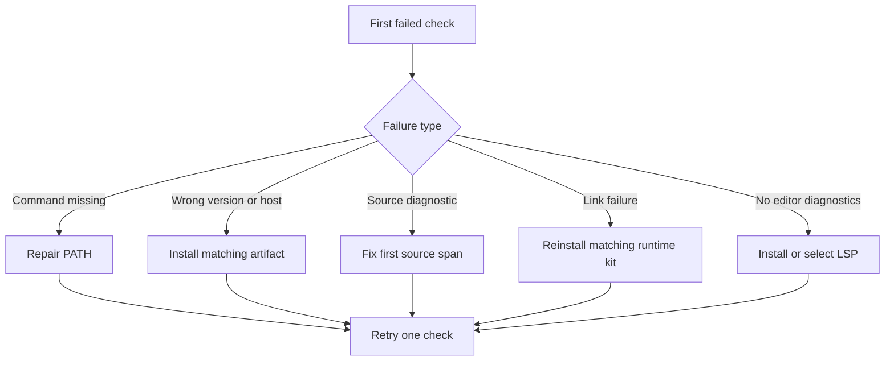

Use the first failed observation to select a recovery path. Do not change multiple installation or source settings at the same time.

## Prerequisites

Keep the failing command, its complete output, your operating system, and the output of `beskid --version` when that command works.

## Actions

1. If `beskid` is not found, inspect which executable a new terminal selects.
2. If the version or host is wrong, compare `beskid --version` and `beskid up host-target` with the selected Downloads artifact.
3. If `beskid analyze Main.bd --plain` fails, correct the span in the first diagnostic while you keep the entrypoint spelling `Main`.
4. If `beskid run Main.bd --plain` reaches linking and fails, reinstall the compiler and runtime kit from the same release.
5. If VS Code has no diagnostics, run **Beskid: Install LSP**.
6. Reload the VS Code window after the LSP installation completes.
7. Inspect the extension output channel for the selected server path.
8. Run one failed check again. Its observable result must match the task page before you continue.

### Diagram text

| Observation | Recovery |
| --- | --- |
| Shell cannot find `beskid` | Open a new terminal and repair `PATH`. |
| Version or host does not match | Install the exact host artifact from Downloads. |
| Analysis emits a diagnostic | Fix the first named source span, then analyze again. |
| AOT link fails on the runtime kit | Reinstall compiler and runtime files from one release. |
| VS Code shows no diagnostics | Install or explicitly select the language server. |

## Expected result

The previously failing check now succeeds without introducing a new failure in an earlier check.

## Recovery

If the same check still fails, capture the exact command, full output, Beskid version, host target, and selected release tag. Search existing project issues before you report a new one. Do not post tokens, credentials, or private source code.

## Next task

Return to [Get started](/docs/getting-started/) and continue with the first incomplete task, or open [Tooling](/docs/tooling/) after all checks pass.
