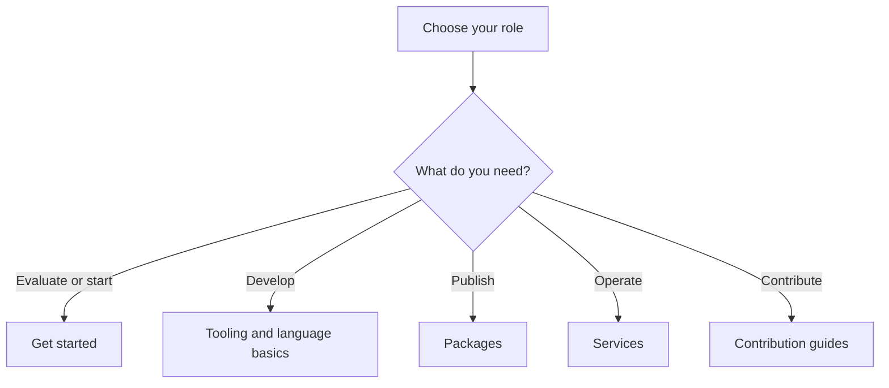

Use these guides for technical work with Beskid. Use the [Beskid Standard](/docs/standard/) when you need a normative requirement.

## Prerequisites

Know the result that you want. You do not need to install Beskid to evaluate the documentation.

## Actions

1. Select your role in the diagram.
2. Open the linked guide for your first task.
3. Check the annotation below each page title. It identifies the source and the verification revision.
4. Return to this page when your role or task changes.

### Diagram text

| Need | First guide |
| --- | --- |
| Evaluate or start | [Get started](/docs/getting-started/) |
| Develop | [Tooling](/docs/tooling/) and [language basics](/docs/language-basics/) |
| Publish | [Packages](/docs/packages/) |
| Operate | Service operation guides in the Operate navigation group |
| Contribute | [Documentation authoring](/docs/contributing/documentation/) |

## Expected result

You are on a task page whose audience and authority annotation match your work.

## Recovery

If a link describes a different task, return here and select the result that you need. If guidance conflicts with the standard, follow the standard and report the documentation mismatch.

## Next task

Start with [installing Beskid](/docs/getting-started/install/) or read [the language basics](/docs/language-basics/) before you evaluate source code.
