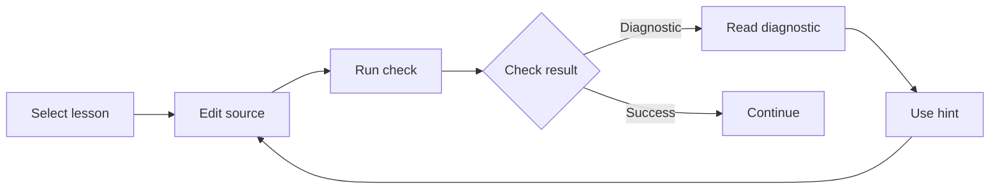

Beskid Learn is a browser lesson service. Each check writes the selected source to a temporary workspace and runs the chosen check. The service does not retain learner source from that temporary workspace as durable state.

## Prerequisites

Use a browser and an internet connection. Choose a lesson goal before you start. The lesson check uses a temporary workspace, so save work that you need outside the lesson.

## Actions

1. Open [Beskid Learn](https://learn.beskid-lang.org) in your browser.
2. Select a lesson that matches the language feature or command that you want to learn.
3. Edit the source in the lesson editor to complete the current instruction.
4. Run the lesson check and wait for the result.
5. Read the diagnostic and its source location when the check reports an error.
6. Use the lesson hint when the diagnostic does not explain the next change.
7. Edit the source and run the check again until the lesson reports success.
8. Continue to the next lesson when you can explain the successful change.

### Diagram text

1. Select a lesson and edit its source in the browser.
2. Run the check to receive a diagnostic or a successful result.
3. Read the diagnostic and use a hint before you edit the source again.
4. After success, continue to the next lesson and use the same loop.

## Expected result

You can complete a lesson with a successful check and explain the related diagnostic recovery. Each check used a temporary workspace. You are ready to continue with a local project when browser practice no longer meets your goal.

## Recovery

Read the diagnostic before you change the source. Use a hint when you cannot identify the next change. If the browser lesson cannot complete, save the relevant diagnostic and use the [Learn service contract](/docs/services/learn/) only for service availability and operator ownership. Do not treat a temporary workspace as persistent storage.

## Next task

Open [Projects](/docs/projects/) to create and manage local project work. Use [Write and run a program](/docs/getting-started/first-program/) when you need the local CLI path.
