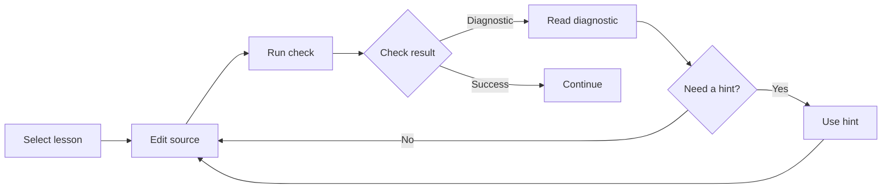

Beskid Learn is a browser lesson service. A lesson check sends the selected source to the service. The service writes the source to a temporary workspace and runs the chosen check. Do not enter secrets or sensitive data in a browser lesson.

## Prerequisites

Use a browser and an internet connection. Choose a lesson goal before you start. The lesson check uses a temporary workspace, so save work that you need outside the lesson. Do not use lesson source for secrets or sensitive data.

## Actions

1. Open [Beskid Learn](https://learn.beskid-lang.org) in your browser.
2. Select a lesson that matches the language feature or command that you want to learn.
3. Edit the source in the lesson editor to complete the current instruction.
4. Run the lesson check. Its result appears after the service completes the check.
5. Read the diagnostic and its source location when the check reports an error.
6. Use the lesson hint only when the diagnostic does not explain the next change.
7. Edit the source to address the diagnostic or hint.
8. Run the lesson check again until it reports success.
9. Continue to the next lesson when you can explain the successful change.

The feedback loop shows when to read a diagnostic, use a hint, and continue.

### Diagram text

1. Select a lesson and edit its source in the browser.
2. Run the check to receive a diagnostic or a successful result.
3. Read the diagnostic. Use a hint only when you need more help, then edit the source again.
4. After success, continue to the next lesson and use the same loop.

## Expected result

You can complete a lesson with a successful check and explain the related diagnostic recovery. Each check used a temporary workspace. You are ready to install the local CLI and start a local project when browser practice no longer meets your goal.

## Recovery

Read the diagnostic before you change the source. Use a hint when you cannot identify the next change. If the browser lesson cannot complete, save the relevant diagnostic and use the [Learn service contract](/docs/services/learn/) only for service availability and operator ownership. Do not treat a temporary workspace as persistent storage.

## Next task

Open [Install Beskid](/docs/getting-started/install/) before you use the local CLI. Then [write and run a program](/docs/getting-started/first-program/) and use [Projects](/docs/projects/) for local project work.
