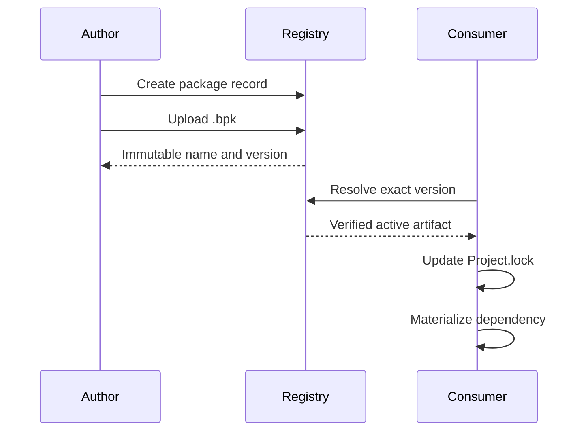

The registry stores a `.bpk` artifact at an immutable package name-and-version coordinate. Use `beskid pckg` for ordinary package commands. The equivalent grouped form is `beskid dev package registry`; this guide uses the concise form.

## Prerequisites

A package author needs a package name and a publisher API key with publish scope. A package consumer needs the package name and an exact active version.

## Actions

1. [Configure credentials and recovery](/docs/packages/credentials-and-recovery/) before a package mutation.
2. [Create, pack, inspect, and upload a package](/docs/packages/publish/).
3. [Consume the exact package version](/docs/packages/consume/) through a project manifest and lockfile.

### Diagram text

The package author first creates the package record. The author then packs and uploads one artifact. The registry assigns that artifact to an immutable name-and-version coordinate. A package consumer declares that exact version. Project resolution downloads the active, not-yanked artifact, records it in `Project.lock`, and materializes the dependency. A yanked version stays recorded but is not available for new downloads.

## Expected result

The author can verify one immutable name-and-version coordinate and its checksum. The consumer has the same exact version in `Project.lock` and under `obj/beskid/deps`.

## Recovery

If identity, checksum, or generated documentation is wrong, do not upload the artifact. Use [credentials and recovery](/docs/packages/credentials-and-recovery/) for authentication failures, yanking, and key rotation.

## Next task

[Publish a package](/docs/packages/publish/) or [consume a package](/docs/packages/consume/).
