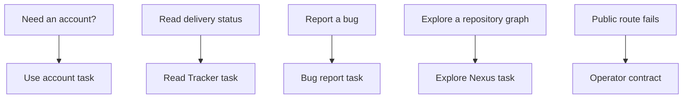

Use this guide to select a public platform task. Read public information before you sign in. Use an operator contract only for service operation, not ordinary product use.

## Orientation

Use a browser and an internet connection. Identify the platform task that you need to complete. Record a public route and visible error when a service does not respond.

## Choose a platform task

1. Open [Use your account](/docs/platform/account/) when you need the Hub sign-in or account page.
2. Open [Read Tracker](/docs/platform/tracker/) when you need delivery status or public bugs.
3. Open [Report a bug](/docs/platform/report-bug/) when you have a reproducible problem.
4. Open [Explore Nexus](/docs/platform/nexus/) when you need a repository graph.
5. Open the linked operator contract only when the public route needs service recovery.

The task map keeps public product use separate from service recovery.

### Diagram text

1. Use the account task for an account sign-in or account page.
2. Use the Tracker task to read delivery status. This public task does not maintain a version or workstream.
3. Use the bug task to report a reproducible problem after you sign in.
4. Use the Nexus task to select an indexed repository graph and inspect it.
5. Use an operator contract only when a public route fails. It preserves service recovery actions outside ordinary product use.

## Limits

You have a selected task for the account, delivery status, bug, or repository graph. You know that service recovery belongs in the linked operator contract.

If a public route fails, record its URL, time, and visible error. Give that record to the service operator. Do not provide a secret, pairing value, or private response body.

## Next steps

Open [Use your account](/docs/platform/account/) to begin with the Hub, or open [Read Tracker](/docs/platform/tracker/) to read delivery status.
