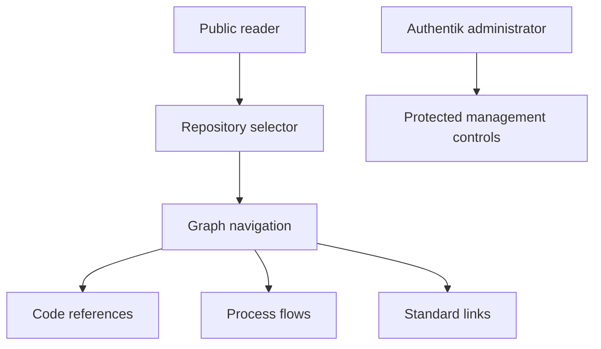

Nexus lets public readers browse an indexed repository graph. First get a trusted Nexus origin from the service owner. The pinned contract makes Caddy the public entry point. The root path selects the first indexed repository. Graph administration is an Authentik administrator task.

## Prerequisites

Use a browser, a trusted Nexus origin, and an indexed repository. The trusted Nexus origin has the form `https://<nexus-host>`. Do not use administrator credentials or an MCP connection for graph reading.

## Actions

1. Confirm the trusted Nexus origin with the service owner.
2. Open `<verified Nexus origin>/`.
3. Use `<verified Nexus origin>/?repo=<catalog-id>` to open a known repository directly.
4. Select an indexed repository from the repository selector.
5. Search symbols to select a node in the repository graph.
6. Open code references or process flows when the selected node provides them.
7. Open a related [Beskid Standard](/docs/standard/) link when the node provides one.

### Diagram text

1. A public reader selects an indexed repository with the repository selector or a direct query.
2. Graph navigation selects nodes and exposes their available code references.
3. Process flows explain detected execution paths when the indexed graph contains them.
4. Standard links lead to related Beskid Standard material when the selected node has indexed links.
5. An Authentik administrator manages protected controls. This role boundary does not give a public reader administrator permissions.

## Expected result

You can view the selected repository graph and inspect a selected code reference, process flow, or Standard link when the index provides it.

## Recovery

If you have no trusted origin, stop and use the [Nexus operator contract](/docs/services/nexus/). If Nexus shows an empty state, do not attempt indexing or administration. No indexed repository is available to read. If it is loading, wait for the graph request to finish before you change the selection. If the public route remains unavailable, record the visible error and use the [Nexus operator contract](/docs/services/nexus/). Do not request administrator credentials.

## Next task

Open [Read Tracker](/docs/platform/tracker/) to read delivery status, or open [Use your account](/docs/platform/account/) for the Hub account page.
