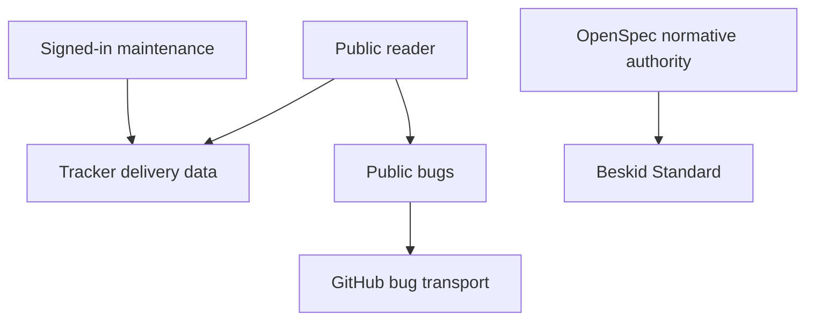

Tracker is the delivery authority for versions, roadmap tasks, and bugs. OpenSpec is the normative authority for language behavior. GitHub carries public bugs only; it does not own roadmap data.

## Prerequisites

Use a browser and identify the delivery version or public bug that you want to read. Public reading does not require a sign-in. You need sign-in for version and workstream maintenance. Sign-in does not grant all maintenance permissions. A signed-in collaborator can create and move issues. Only a repository owner or org admin can define new `roadmap/version/*` labels. Only a repository owner or org admin can approve `roadmap/spec-approval/*` links.

## Actions

1. Open the [Tracker delivery timeline](https://tracker.beskid-lang.org/).
2. Select the delivery version that you want to read.
3. Open the [public bug list](https://tracker.beskid-lang.org/bugs) when you need known bug status.
4. Open [Report a bug](/docs/platform/report-bug/) when the public list does not contain your problem.
5. Use the [Beskid Standard](/docs/standard/) when you need a normative behavior requirement.

### Diagram text

1. A public reader opens Tracker to read delivery data and public bugs.
2. Tracker remains the delivery authority for versions, workstreams, and roadmap tasks.
3. OpenSpec is the normative authority. The Beskid Standard publishes its accepted behavior requirements.
4. GitHub is bug transport for eligible public bugs. It does not replace Tracker delivery data.
5. Signed-in maintenance changes delivery records. It is separate from public reading and from the user procedure on this page.

## Expected result

You can read the delivery timeline and public bugs. You can distinguish Tracker delivery authority from OpenSpec normative authority and GitHub bug transport.

## Recovery

If a public route does not load, record the public route, time, and visible error. Do not change a version or workstream to recover a reading problem. Use the [Tracker operator contract](/docs/services/tracker/) for service recovery.

## Next task

Open [Report a bug](/docs/platform/report-bug/) when you have a reproducible problem, or open [Explore Nexus](/docs/platform/nexus/) to read repository relationships.
