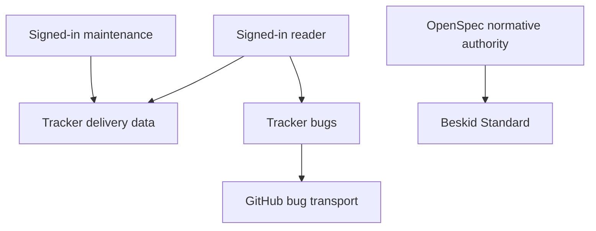

Tracker is the delivery authority for versions, roadmap tasks, and bugs. OpenSpec is the normative authority for language behavior. GitHub carries public bugs only; it does not own roadmap data.

## Prerequisites

Use a browser and identify the delivery version or bug that you want to read. Tracker requires Authentik sign-in and a session before reading any route. Sign-in does not grant all maintenance permissions. A signed-in collaborator can create and move issues. Only a repository owner or org admin can define new `roadmap/version/*` labels. Only a repository owner or org admin can approve `roadmap/spec-approval/*` links.

## Actions

1. Open the [Tracker delivery timeline](https://tracker.beskid-lang.org/).
2. Complete Authentik sign-in before reading the delivery timeline.
3. Select the delivery version that you want to read.
4. Open the [bug list](https://tracker.beskid-lang.org/bugs) when you need known bug status.
5. Open [Report a bug](/docs/platform/report-bug/) when the list does not contain your problem.
6. Use the [Beskid Standard](/docs/standard/) when you need a normative behavior requirement.

The authority map separates signed-in reading, delivery maintenance, normative rules, and bug transport.

```mermaid
flowchart TD
  accTitle: Tracker delivery and bug authority
  accDescr: A signed-in reader reads Tracker delivery data and bugs. OpenSpec defines normative behavior. GitHub transports eligible bug reports. Maintenance remains separately authorized.
  R[Signed-in reader] --> T[Tracker delivery data]
  R --> B[Tracker bugs]
  B --> G[GitHub bug transport]
  O[OpenSpec normative authority] --> S[Beskid Standard]
  M[Signed-in maintenance] --> T
```

### Diagram text

1. A signed-in reader uses an Authentik session to open Tracker delivery data and bugs.
2. Tracker remains the delivery authority for versions, workstreams, and roadmap tasks.
3. OpenSpec is the normative authority. The Beskid Standard publishes its accepted behavior requirements.
4. GitHub is bug transport for eligible bugs. It does not replace Tracker delivery data.
5. Authorized maintenance changes delivery records. Sign-in alone does not grant that permission.

## Expected result

After sign-in, you can read the delivery timeline and bugs. You can distinguish Tracker delivery authority from OpenSpec normative authority and GitHub bug transport.

## Recovery

If the route does not load after sign-in, record the public route, time, and visible error without copying cookies. Do not change a version or workstream to recover a reading problem. Use the [Tracker operator contract](/docs/services/tracker/) for service recovery.

## Next task

Open [Report a bug](/docs/platform/report-bug/) when you have a reproducible problem, or open [Explore Nexus](/docs/platform/nexus/) to read repository relationships.
