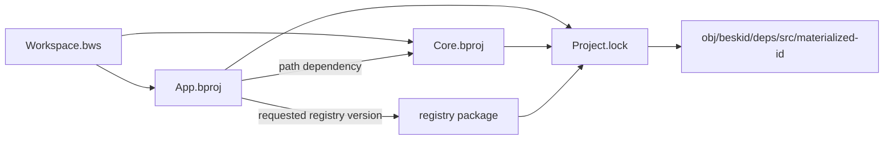

A project manifest has the `.bproj` extension. A workspace manifest has the `.bws` extension. Project commands resolve one project before they resolve its targets and dependencies.

## Prerequisites

Run `beskid --version`. Keep exactly one `.bproj` file in each project directory.

## Actions

1. [Create one project](/docs/projects/create/) and verify its manifest and source tree.
2. [Group projects in a workspace](/docs/projects/workspaces/) when one checkout contains related projects.
3. [Resolve dependencies and control Project.lock](/docs/projects/dependencies-and-locks/).
4. Pass `--project` when automatic discovery could select the wrong manifest.

### Diagram text

The workspace manifest lists the application and library members. The application project manifest declares a path dependency on the library project manifest. It can also request a registry version. Resolution records both dependency kinds in `Project.lock`. Registry resolution can select a different active version, so you must inspect the lockfile. The resolver copies each materialized dependency under `obj/beskid/deps/src/<materialized-id>`.

## Expected result

Each command has one selected project and, when needed, one selected target. A reviewed and committed `Project.lock` records the dependency graph that later locked commands preserve.

## Recovery

If a directory contains multiple `.bproj` files, automatic discovery reports an error. Remove the duplicate or pass the exact manifest with `--project`. If a workspace member is wrong, pass `--workspace-member`.

## Next task

[Create a project](/docs/projects/create/) or go directly to [dependencies and locks](/docs/projects/dependencies-and-locks/) for an existing project.
