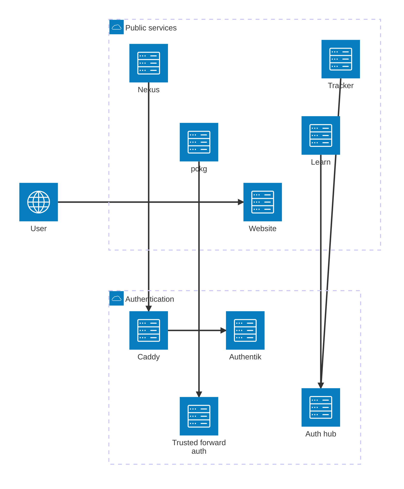

Beskid has separate services for guidance, identity, learning, packages, delivery, and repository graphs. Select a service task before you diagnose a public service status.

## Orientation

Identify your service task. Check the public service status and record the page URL, time, and visible error.

## Choose a service guide

1. Read [Authentication](/docs/services/authentication/) before you diagnose sign-in or service pairing.
2. Select [Learn](/docs/services/learn/), [pckg](/docs/services/pckg/), [Tracker](/docs/services/tracker/), or [Nexus](/docs/services/nexus/).
3. Use [Health and monitoring](/docs/operations/health-and-monitoring/) if a service does not respond.

The root Auth README says that pckg and Nexus use the Auth hub. That claim conflicts with the pinned, service-owned contracts and is under reconciliation. This page follows the service-owned contracts: pckg uses a separate trusted forward-auth boundary, and Nexus uses Caddy with Authentik.

The diagram shows the public service and authentication topology.

### Diagram text

| Service | Public function | Authentication relationship |
| --- | --- | --- |
| Website | Provides public guidance and the Docs. | Public reading does not require sign-in. |
| Auth hub | Performs GitHub OAuth and issues paired-service handoffs. | Tracker and configured Learn sessions use this boundary. |
| Learn | Runs interactive learning checks. | Its deployment can use configured auth-hub pairing values. |
| pckg | Serves package metadata and package artifacts. | CLI publication uses registry bearer keys. Protected browser routes require a separate trusted forward-auth boundary. |
| Tracker | Publishes delivery status and bugs from its own data. | It uses the Auth hub for GitHub sign-in. |
| Nexus | Presents a repository graph and an MCP endpoint. | Caddy and Authentik form its pinned forward-auth boundary. |

## Limits

You can name the selected service boundary and its authentication boundary. You also know which service owns persistent state.

If the public route fails, check the documented health endpoint. Give the service operator the URL, time, release identity, and response status. Do not send a credential or private response body.

## Next steps

[Check service health and monitoring](/docs/operations/health-and-monitoring/).
