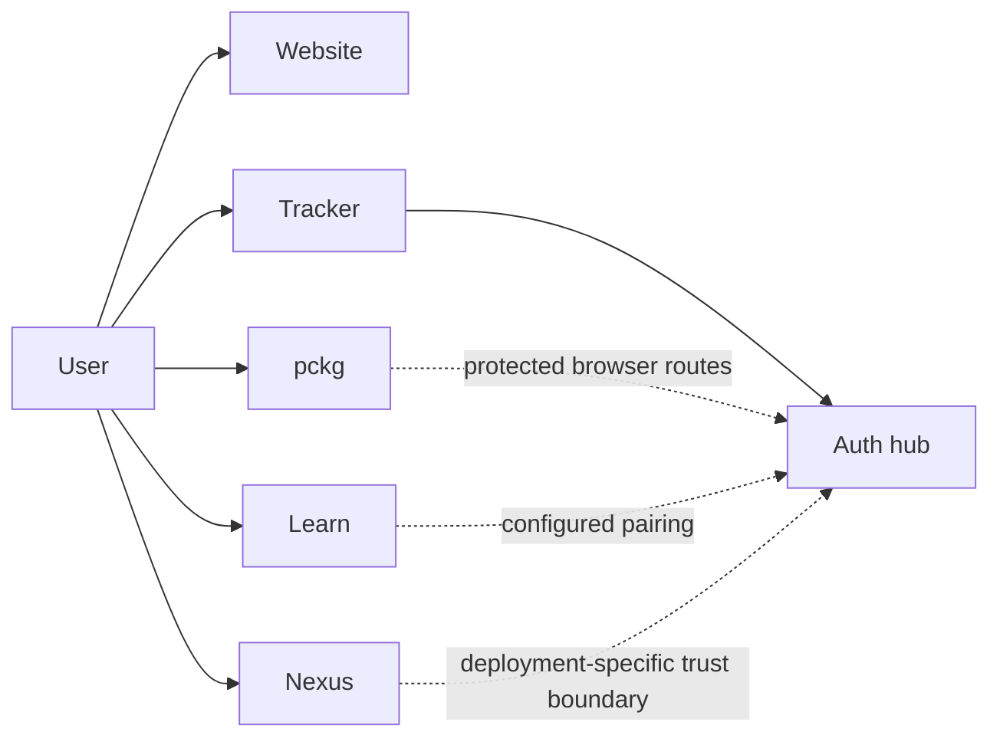

Beskid has separate services for guidance, identity, learning, packages, delivery, and repository graphs. Select a service task before you diagnose a public service status.

## Prerequisites

Identify your service task. Check the public service status and record the page URL, time, and visible error.

## Actions

1. Read [Authentication](/docs/services/authentication/) before you diagnose sign-in or service pairing.
2. Select [Learn](/docs/services/learn/), [pckg](/docs/services/pckg/), [Tracker](/docs/services/tracker/), or [Nexus](/docs/services/nexus/).
3. Use [Health and monitoring](/docs/operations/health-and-monitoring/) if a service does not respond.

The diagram shows the public service and authentication topology.

### Diagram text

| Service | Public function | Authentication relationship |
| --- | --- | --- |
| Website | Provides public guidance and the Docs. | Public reading does not require sign-in. |
| Auth hub | Performs GitHub OAuth and issues paired-service handoffs. | It is the only GitHub OAuth app for paired Beskid services. |
| Learn | Runs interactive learning checks. | Its deployment can use configured auth-hub pairing values. |
| pckg | Serves package metadata and package artifacts. | CLI publication uses registry bearer keys. Protected browser routes require a verified boundary. |
| Tracker | Publishes delivery status and bugs from its own data. | It uses the Auth hub for GitHub sign-in. |
| Nexus | Presents a repository graph and an MCP endpoint. | Its pinned service contract uses a proxy forward-auth boundary. |

## Expected result

You can name the selected service boundary and its authentication boundary. You also know which service owns persistent state.

## Recovery

If the public route fails, check the documented health endpoint. Give the service operator the URL, time, release identity, and response status. Do not send a credential or private response body.

## Next task

[Check service health and monitoring](/docs/operations/health-and-monitoring/).
