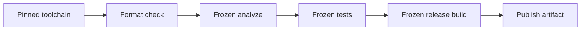

Use one pinned toolchain release and a committed lockfile. `--frozen` requires current resolution and forbids a lockfile update. `--plain` disables animated output.

## Prerequisites

Commit the project `.bproj` manifest and `Project.lock`. Pin the same immutable Beskid release on every runner. Store package credentials in the CI secret store, not in the repository or command log.

## Actions

1. Install the pinned toolchain release.
2. Verify the selected version and target:

   ```bash
   beskid --version
   beskid up host-target
   ```

3. Check the case-sensitive `Src` source root without changing files. Substitute the path when the manifest declares a different source root:

   ```bash
   beskid format Src --check
   ```

4. Analyze with frozen resolution:

   ```bash
   beskid analyze --project App.bproj --frozen --plain
   ```

5. Run tests with frozen resolution and a machine-readable summary:

   ```bash
   beskid test --project App.bproj --all-targets --frozen --plain --json
   ```

6. Build the release target with the same resolution policy:

   ```bash
   beskid build --project App.bproj --target App --release --frozen --plain
   ```

7. Publish only the output from a job in which all prior commands succeeded.



### Diagram text

1. Install and verify one immutable toolchain release.
2. Check formatting before compilation.
3. Use `--frozen` for analysis, tests, and the release build.
4. Publish only after every gate succeeds.

## Expected result

Every gate uses the same toolchain and lockfile. Logs contain stable, non-animated output. The final job retains the native release artifact only after format, analysis, and tests succeed.

## Recovery

If `--frozen` rejects the project, update and review `Project.lock` outside CI, then commit it. If the host target differs, select the matching runner or release artifact. If a test fails, retain its JSON summary and do not publish the build.

## Next task

Read [Projects](/docs/projects/) for manifest and lockfile tasks, or [Packages](/docs/packages/) before you publish a package.
