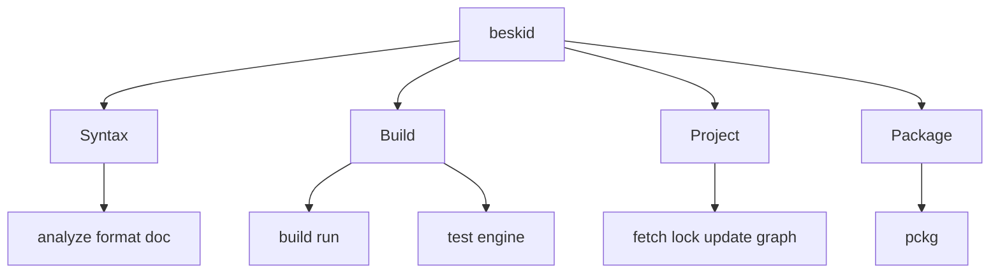

Use concise root commands for routine work. Use `beskid dev` groups when a script or explanation benefits from an explicit domain.

## Orientation

Install Beskid and open a terminal in the source or project directory. Run `beskid --help` before you infer a command name.

## Choose a command

1. Use `beskid analyze`, `beskid format`, or `beskid doc` for source tasks.
2. Use `beskid build` to create an AOT artifact. Use `beskid run` to create and start a temporary AOT executable.
3. Only `beskid build` and `beskid run` use the AOT pipeline. `beskid test` uses the current test execution engine.
4. Use `beskid fetch`, `beskid lock`, `beskid update`, or `beskid graph` for project tasks.
5. Use `beskid pckg` for registry tasks.
6. Use the grouped alias when you need the domain in the command path:

   | Domain | Grouped commands |
   | --- | --- |
   | Syntax | `beskid dev syntax parse`, `tree`, `analyze`, `doc`, `format`, `clif` |
   | Build | `beskid dev build compile`, `test`, `corelib` |
   | Project | `beskid dev project fetch`, `lock`, `update`, `graph` |
   | Package | `beskid dev package registry` |

7. Add `--plain` to analysis, build, run, and test commands in logs or automation.

### Diagram text

- Syntax commands inspect or change source text.
- Build commands create an AOT artifact or an AOT subprocess.
- The test command uses the current test execution engine.
- Project commands resolve manifests, lockfiles, dependencies, and graphs.
- Package commands communicate with the package registry.

## Limits

The selected command help describes the input and flags for one task. The concise and grouped forms dispatch to the same command implementation where a grouped alias exists.

If the CLI rejects a command path, run `beskid --help`, then run `--help` on the next command group. Do not combine segments from different groups. Use the concise root command when a grouped path makes a script harder to read.

## Next steps

Use [build, run, and test](/docs/tooling/build-run-test/) for local work or [run Beskid in CI](/docs/tooling/ci/) for automation.
