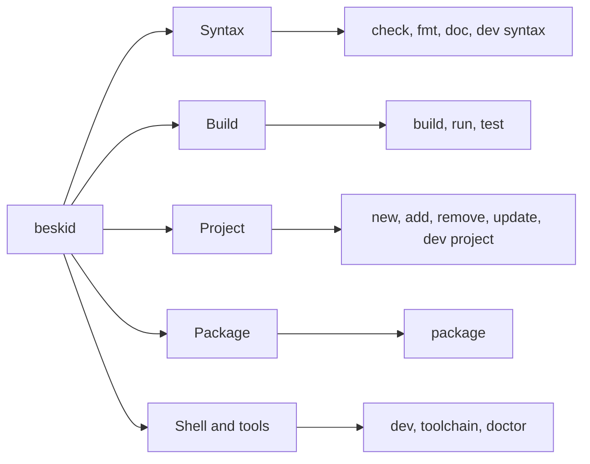

Use root commands for routine work. Use `beskid dev` for inspection, plumbing, and maintenance tasks.

## Orientation

Install Beskid and open a terminal in the source or project directory. Run `beskid --help` before you infer a command name.

## Choose a command

1. Use `beskid check`, `beskid fmt`, or `beskid doc` for source tasks.
2. Use `beskid build` to create an AOT artifact. Use `beskid run` to create and start a temporary AOT executable.
3. Only `beskid build` and `beskid run` use the AOT pipeline. `beskid test` uses the current test execution engine.
4. Use `beskid add`, `beskid remove`, or `beskid update` to change project dependencies. `beskid update` needs a package name or `--all`.
5. Use `beskid dev project lock`, `beskid dev project fetch`, or `beskid dev project graph` for lock, materialization, and graph tasks.
6. Use `beskid package` for registry tasks.
7. Use `beskid dev` for inspection and maintenance tasks:

   | Domain | Commands |
   | --- | --- |
   | Syntax | `beskid dev syntax parse`, `tree`, `clif` |
   | Project | `beskid dev project fetch`, `lock`, `graph` |
   | BSOL | `beskid dev bsol validate <manifest>.bproj`, `beskid dev bsol migrate` |
   | Other | `beskid dev repl`, `mod`, `import`, `lsp`, `corelib`, `runtime-kit` |

8. Add `--plain` to check, build, run, and test commands in logs or automation. `beskid update` has no `--plain` option.

```mermaid
flowchart LR
  accTitle: CLI taxonomy
  accDescr: The Beskid CLI groups commands by domain. Syntax, build, project, package, and shell command groups each hold the commands for that task.
  root[beskid] --> S[Syntax]
  root --> B[Build]
  root --> P[Project]
  root --> K[Package]
  root --> H[Shell and tools]
  S --> S1["check, fmt, doc, dev syntax"]
  B --> B1["build, run, test"]
  P --> P1["new, add, remove, update, dev project"]
  K --> K1["package"]
  H --> H1["dev, toolchain, doctor"]
```

### Diagram text

- Syntax commands inspect or change source text.
- Build commands create an AOT artifact or an AOT subprocess.
- The test command uses the current test execution engine.
- Project commands resolve manifests, lockfiles, dependencies, and graphs.
- Package commands communicate with the package registry.

## Limits

The selected command help describes the input and flags for one task. The 0.6.0 CLI removed the root commands `lock`, `analyze`, `repl`, `graph`, `fetch`, and `validate-bsol`. If you run a removed command, the CLI prints the replacement.

If the CLI rejects a command path, run `beskid --help`, then run `--help` on the next command group. Do not combine segments from different groups. Use the concise root command when a grouped path makes a script harder to read.

## Next steps

Use [build, run, and test](/docs/tooling/build-run-test/) for local work or [run Beskid in CI](/docs/tooling/ci/) for automation.
