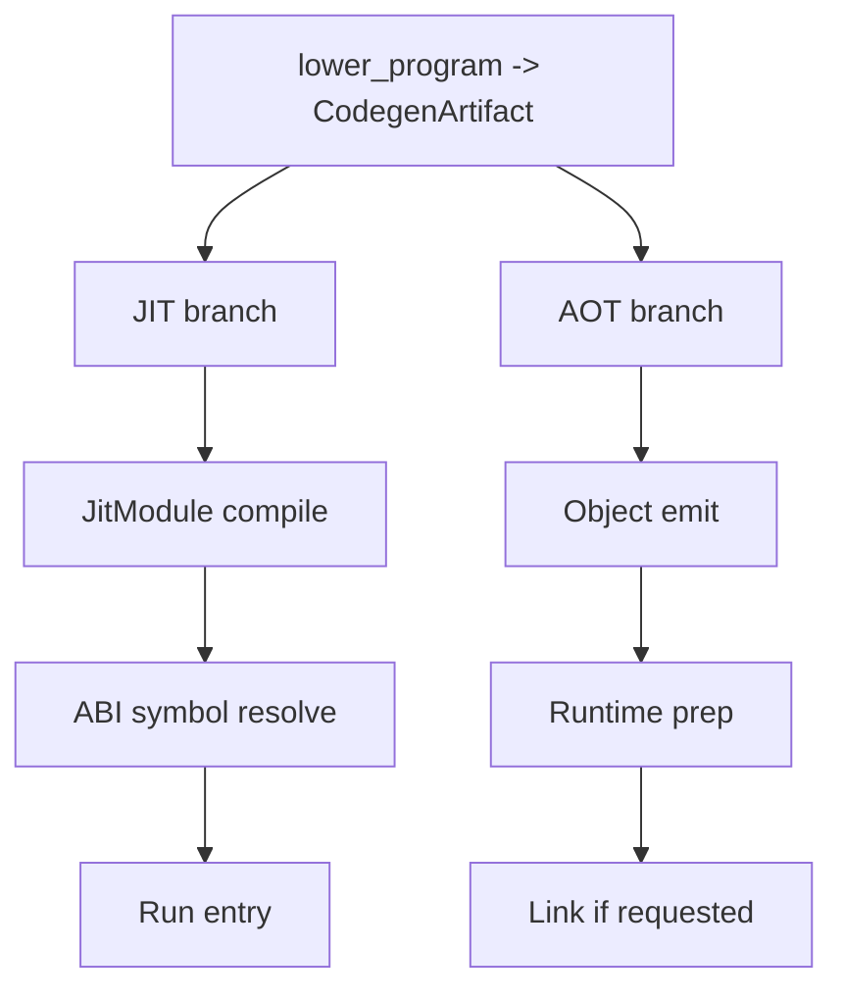

import SpecArticleChrome from '@beskid/beskid-ui/platform-spec/SpecArticleChrome.astro';

<SpecArticleChrome />

## JIT flow

1. Lower source with diagnostics.
2. Compile artifact in `JitModule`.
3. Resolve and validate entrypoint against manifest.
4. Execute and return formatted result.

## AOT flow

1. Lower source with diagnostics.
2. Build request from CLI flags.
3. Emit object module.
4. Prepare runtime and link when output kind requires it.
