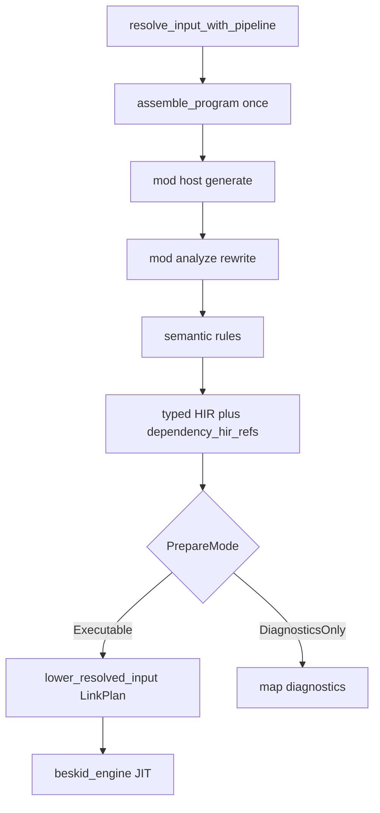

import SpecArticleChrome from '@beskid/beskid-ui/platform-spec/SpecArticleChrome.astro';

<SpecArticleChrome />

This article documents the **design model** for **build and run orchestration**: one prepared front-end consumed by every command surface.

## Core objects

| Object | Role |
|--------|------|
| `ResolvedInput` | Source path/text, `CompilePlan`, materialized `PreparedProjectWorkspace`, and cached `ProgramAssembly` from resolve |
| `PreparedCompilation` | Output of `prepare_compilation`: post-rewrite entry AST, typed entry HIR, `Resolution`, `TypeResult`, mod session metadata, and shared `ProgramAssembly` |
| `PrepareMode` | `DiagnosticsOnly` (analyze, LSP) vs `Executable` (run, build, test, clif)—same code path, different early exit |
| `CodegenArtifact` | Cranelift IR bundle from `lower_resolved_input_with_pipeline` after `LinkPlan` (see lowering-contract ADRs) |

## PreparedCompilation flow

1. **Resolve** — `beskid_cli` / LSP build `ResolvedInput`; populate `assembly` once (no silent re-assemble per consumer).
2. **Prepare** — `prepare_compilation` (alias: `compile_front_end_from_resolved_input`) runs mod rewrite **before** semantic rules (D-COMP-BUILD-0020).
3. **Execute** — `run`, `build`, `test`, and `clif` share one prepare per target; `test` discovers items from post-rewrite AST and runs `qualified_name` entrypoints (D-COMP-BUILD-0021).
4. **Backend** — JIT/AOT load `CodegenArtifact` only; they do not rebuild `CompilePlan` or rediscover modules.

## Anchored code paths

- `compiler/crates/beskid_analysis/src/services/front_end.rs` — prepare / typed HIR spine
- `compiler/crates/beskid_analysis/src/services/input.rs` — `ResolvedInput` and assembly cache
- `compiler/crates/beskid_cli/src/commands/` — run, build, test, analyze, clif
- `compiler/crates/beskid_codegen/src/services.rs` — `lower_resolved_input_with_pipeline`
- `compiler/crates/beskid_engine/src/engine.rs` — JIT from artifact

## Practical notes

- Trace from `resolve_input_with_pipeline` through `prepare_compilation`; avoid parallel analyze-only schedulers.
- If behavior changes, update ADRs D-COMP-BUILD-0019 … D-COMP-BUILD-0021 and spine parity fixtures (D-COMP-CONF-0007).
