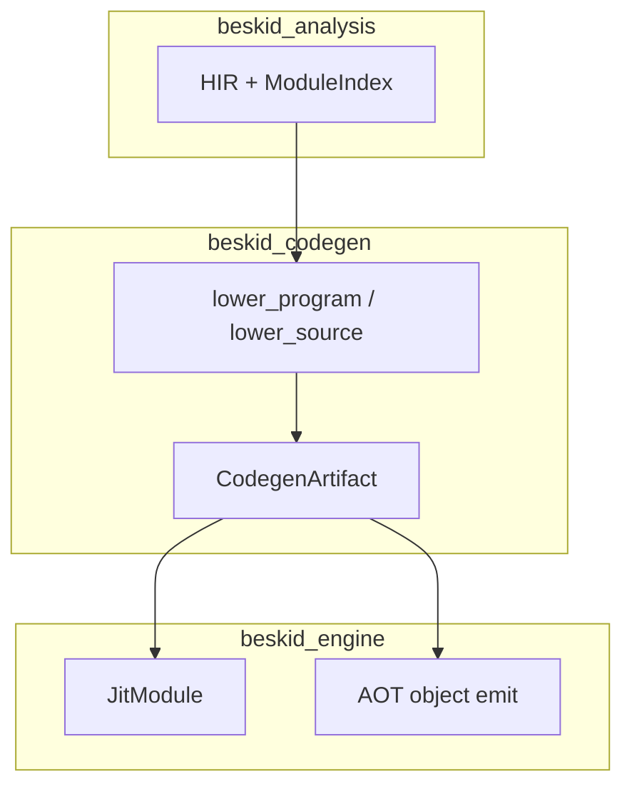

import SpecArticleChrome from '@beskid/beskid-ui/platform-spec/SpecArticleChrome.astro';

<SpecArticleChrome />

## Lowering boundary

Lowering is the **last semantic gate** before any backend runs. Inputs are a post-merge program snapshot (HIR + `ModuleIndex` + resolved types); output is an immutable **`CodegenArtifact`** containing Cranelift modules, data descriptors, extern imports, and debug metadata.

Backends **must not** re-run parse, mod host, or semantic rules on the artifact.

## Artifact contents

| Slice | Role |
| --- | --- |
| CLIF modules | Per-compilation-unit functions and globals |
| Builtin imports | `declare_builtin_imports` from `BUILTIN_SPECS` |
| `ExternImport` rows | User contract symbols for link step |
| Type descriptors | GC layout + array/string shapes for `alloc` |

## Invariants

- Lowering runs only when `syntax_generation_id` matches the merged tree used by semantic rules ([stage ordering](/platform-spec/compiler/build-pipeline/stage-ordering/)).
- Panic/abort paths use `AbiReturnKind::Never` imports so unreachable blocks are correct.
- JIT and AOT consume the **same** artifact type; divergence happens only after `CodegenArtifact` is sealed.

## Code anchors

- `beskid_codegen::lower_source` in `compiler/crates/beskid_codegen`
- `CodegenArtifact` construction in `compiler/crates/beskid_codegen`
- `JitModule` in `compiler/crates/beskid_engine/src/jit_module.rs`
- Runtime smoke: `compiler/crates/beskid_tests/src/runtime/jit.rs`
