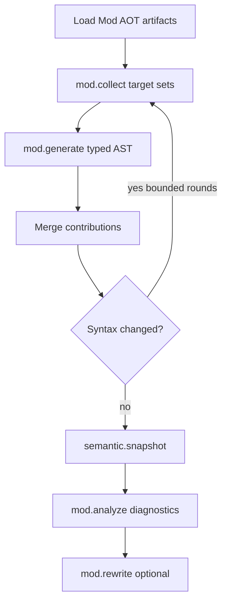

import SpecArticleChrome from '@beskid/beskid-ui/platform-spec/SpecArticleChrome.astro';

<SpecArticleChrome />

## Mod host orchestration

## Primary flow

1. After **`parse`** (and **`macro.expand`**), **`mod.load`** registers contracts from resolved **`Mod`** projects in the dependency graph.
2. **`mod.collect`** records generator/analyzer/rewriter target sets per mod.
3. **`mod.generate`** emits typed AST contributions; the host merges and **re-parses** affected units when syntax changed (bounded by **`maxGeneratorRounds`**).
4. Builtin **semantic rules** run on the merged program; emit **`semantic.snapshot`** before analyzers read frozen state.
5. **`mod.analyze`** publishes diagnostics; **`mod.rewrite`** applies typed replacements when enabled.
6. Emit **`lower.ready`** only when the merged tree is consistent for HIR lowering.

## Ordering constraints

- No mod body runs before a parseable **`Program`** snapshot exists for its compilation unit.
- Analyzers **must not** mutate syntax after **`semantic.snapshot`**; rewrites go through **`mod.rewrite`** only.
- Capability checks and step budgets are enforced in the Rust host before Beskid mod entrypoints run (see [Incremental scheduling and determinism](/platform-spec/compiler/compiler-mods/incremental-scheduling-determinism/)).
