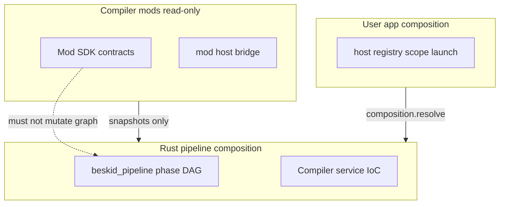

import SpecPageHeader from '@beskid/docs-ui/platform-spec/SpecPageHeader.astro';
import SpecSection from '@beskid/docs-ui/platform-spec/SpecSection.astro';

<SpecPageHeader ownerName="Piotr Mikstacki" ownerEmail="pmikstacki@cybernomad.it" submitterName="Piotr Mikstacki" submitterEmail="pmikstacki@cybernomad.it" />

<SpecSection title="Scope" id="scope">
Pipeline composition is **Rust-only** compiler infrastructure: pass registration, dependency injection between compiler services, phase DAG wiring, and feature-flagged stage enablement.

`Mod` projects and Beskid Compiler Mod SDK contracts **must not** mutate this graph. Mods observe compiler snapshots through SDK surfaces only.

**Phase ordering and lowering** (parse → semantic gates → HIR → CLIF → backends) are specified under [Build pipeline / Stage ordering](/platform-spec/compiler/build-pipeline/stage-ordering/). This area documents *how* those phases are registered and wired in Rust, not the end-to-end stage list itself. Feature-level articles for composition DAG and pass registration may be added here later; until then, treat stage ordering as the authoritative cross-phase contract.
</SpecSection>

<SpecSection title="Boundary" id="boundary">

| Plane | Owner |
| --- | --- |
| Compiler composition / IoC | Rust (`beskid_analysis`, `beskid_pipeline`, related crates) |
| User DI (`host`, `launch`) | [Language meta / composition](/platform-spec/language-meta/composition/) |
| Compiler mods (`type: Mod`) | [Compiler Mods](/platform-spec/compiler/compiler-mods/) + [Compiler Mod SDK](/platform-spec/language-meta/metaprogramming/compiler-mod-sdk/) |
</SpecSection>

<SpecSection title="User program composition (read-only)" id="user-composition">
The reference compiler **resolves** Beskid app composition ([Native dependency injection](/platform-spec/language-meta/composition/dependency-injection/)) at compile time. Rust pipeline code **materializes** a frozen binding plan and **composition snapshot** for lowering and mod queries; it does **not** reinterpret `host` / `registry` / `scope` syntax.

Planned phase id: **`composition.resolve`** (after `semantic.snapshot`, before `mod.analyze`). See [Native DI / Flow and algorithm](/platform-spec/language-meta/composition/dependency-injection/flow-and-algorithm/).
</SpecSection>

<SpecSection title="Implementation anchors" id="anchors">
- `compiler/crates/beskid_pipeline/` — phase ids and observer hooks
- `compiler/crates/beskid_analysis/src/services.rs` — session orchestration
- `compiler/crates/beskid_analysis/src/analysis/rules/staged/` — staged semantic pass graph
- `compiler/crates/beskid_analysis` — planned `composition` module for app DI graph (see native DI feature hub)
</SpecSection>
