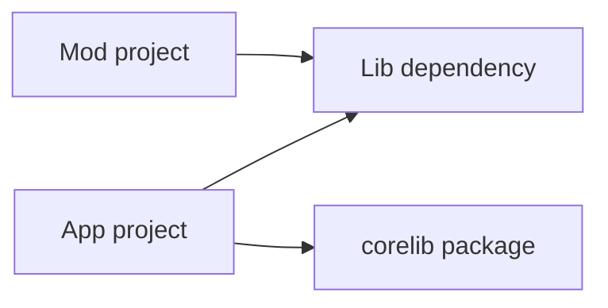

import SpecArticleChrome from '@beskid/beskid-ui/platform-spec/SpecArticleChrome.astro';

<SpecArticleChrome />

## Graph model

Each workspace node is a **`Project.proj`** with typed edges:

| Edge kind | Meaning |
| --- | --- |
| Registry dependency | Resolved version pin from lockfile |
| Path dependency | Relative project root inside workspace |
| Transitive closure | Used for `CompilePlan` and doc workspace scan |

## Cycle policy

Directed cycles **must** be reported during graph build. Policy knobs (`error`, `warn`, permissive) select whether resolution aborts or continues with diagnostics. Cycles involving **`Mod`** projects **must** include the mod id in the diagnostic path.

## Mermaid presentation

User-visible dependency graphs **must** be emitted through `beskid_graph::adapters::project` from the built `ProjectGraph`. The analysis resolver remains the build authority; Mermaid is presentation-only.

## Anchored code paths

- `beskid_analysis::projects::graph` resolver and validator
- `beskid_graph::adapters::project` — canonical Mermaid emitter
- `compiler/crates/beskid_tests/src/projects/corelib/layout.rs` — multi-project layouts
- `compiler/crates/beskid_tests/src/projects/corelib/mod.rs` — graph expectations
- `compiler/crates/beskid_cli/src/commands/doc.rs` — docs consume resolved graph
