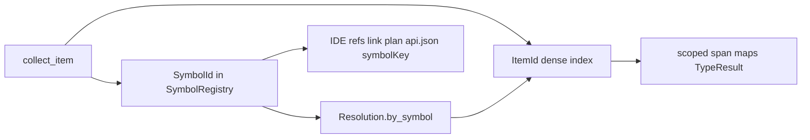

import SpecArticleChrome from '@beskid/beskid-ui/platform-spec/SpecArticleChrome.astro';

<SpecArticleChrome />

## What this covers

Persistent entities produced by **`beskid_analysis::resolve`** and consumed by type checking, codegen, LSP document queries, and `api.json` emission.

## Dual identity model

Two complementary identifiers serve different consumers:

| Identifier | Stable across units? | Primary use |
| --- | --- | --- |
| **`ItemId`** | Within one merged `Resolution.items` table when prefetch ids are preserved | Span maps, `TypeResult`, locals-adjacent rows |
| **`SymbolId` / `SymbolQualifier`** | Yes — package-prefixed registry key | Workspace references, link-plan callee index, `symbolKey`, `@ref` by full path |

**Rule:** Hot paths **must not** replace `ItemId` in type maps. Symbol identity is additive ([D-COMP-SEM-0016](/platform-spec/compiler/semantic-pipeline/resolver-contract/adr/0005-package-prefixed-symbol-identity/)).

## `Resolution` bundle

| Field | Purpose |
| --- | --- |
| `items` | Flat `ItemInfo` table (declaration metadata + spans) |
| `module_graph` | Module tree and per-module `scope: name → ItemId` |
| `tables` | Span → `ResolvedValue` / `ResolvedType`, locals, conformances |
| `symbols` | **`SymbolRegistry`** — interned `SymbolQualifier` entries |
| `by_symbol` | Authoritative **`SymbolId → ItemId`** after collect |
| `module_imports` | `use` alias → logical module path |
| `builtin_items` | Builtin row → `BuiltinSpec` index |

Each exportable `ItemInfo` **may** carry `symbol: Option<SymbolId>`. Lookup helpers in `resolve/symbol_lookup.rs` are the single authority for `qualified_name(res, item)` strings.

## Package assignment

| Unit | `SymbolQualifier.package` |
| --- | --- |
| Entry / host source | `CompilePlan.project_name` |
| Prefetched dependency unit | Declaring dependency's `project_name` |
| Compiler intrinsics | Fixed `beskid` (`SymbolShape::Builtin`) |

`ModuleIndex::build` collects dependency units into the shared registry before entry resolve; entry collect adds entry-local symbols without re-interning prefetch keys.

## Symbol shapes and string encoding

`symbol_to_string(registry, qualifier)` produces canonical `::`-separated keys:

- **ModuleItem** — `package::Module::Path::Name`
- **Member** — parent key + `::` + member short name
- **Method** — `package::ReceiverType::method`
- **Builtin** — `beskid::path::segments`

These strings appear as **`symbolKey`** in `api.json` when emitted ([design model / api.json](/platform-spec/tooling/cli/api-json-contract/design-model/)).

## IDE and tooling consumption

`beskid_analysis::services::document`:

- **Go to definition** canonicalizes `ResolvedValue::Item` through `canonical_item_id` before reading `ItemInfo`.
- **Find references** (including `references_at_offset_workspace`) matches registry symbols by **`SymbolId`** across per-unit re-resolve, falling back to `ItemId` / `LocalId` when no exportable symbol exists.

## Anchored code paths

- `compiler/crates/beskid_analysis/src/resolve/symbol.rs` — shapes, registry, encoding
- `compiler/crates/beskid_analysis/src/resolve/symbol_lookup.rs` — public lookup API
- `compiler/crates/beskid_analysis/src/resolve/resolver.rs` — collect + resolve driver
- `compiler/crates/beskid_analysis/src/resolve/items.rs` — `ItemInfo.symbol`
- `compiler/crates/beskid_analysis/src/resolve/collect.rs` — registry population
- `compiler/crates/beskid_analysis/src/projects/assembly/module_index.rs` — prefetch merge
- `compiler/crates/beskid_analysis/src/services/document.rs` — LSP-oriented queries
