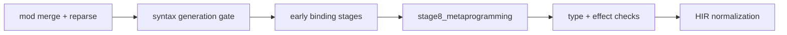

import SpecArticleChrome from '@beskid/beskid-ui/platform-spec/SpecArticleChrome.astro';

<SpecArticleChrome />

## Staged pipeline

Semantic rules run as ordered **`SemanticPipelineRule`** stages on the **post-merge** syntax snapshot (`syntax_generation_id`).

## Anchored code paths

- `compiler/crates/beskid_analysis/src/analysis/rules/staged.rs`
- `compiler/crates/beskid_analysis/src/analysis/diagnostic_kinds.rs`
- `compiler/crates/beskid_analysis/src/services/`

## Meta contributions and staged rules

After the mod host merges **emit** contributions into the syntax model and bumps `syntax_generation_id`, the staged semantic pipeline (`SemanticPipelineRule` in `compiler/crates/beskid_analysis/src/analysis/rules/staged.rs`) **must** run on the **post-merge** program snapshot. **`stage8_metaprogramming`** is reserved for meta-specific semantic checks that still belong to ordinary diagnostics (for example validating attributes produced by meta); it **must not** replace the mod host’s collect/generate/analyze/rewrite orchestration.

**Inspector-only meta** that does not emit still runs **before** the semantic diagnostics gate on the same snapshot generation so diagnostics from meta and builtin rules share one ordering pass unless explicitly partitioned by diagnostic phase metadata.

## Practical notes
- Prefer tracing from CLI/test entry points into analysis/codegen crates before changing internals.
- Treat diagnostics and tests as part of the contract, not optional implementation details.
- If behavior changes, update this article and add/adjust tests in `compiler/crates/beskid_tests` or `compiler/crates/beskid_e2e_tests`.
