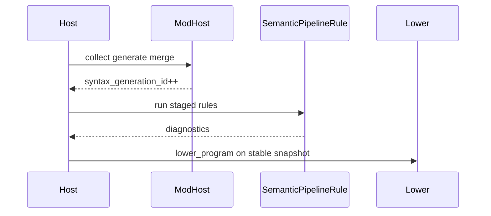

import SpecArticleChrome from '@beskid/beskid-ui/platform-spec/SpecArticleChrome.astro';

<SpecArticleChrome />

## Execution order

1. Host finishes **mod collect/generate/merge** and bumps `syntax_generation_id`.
2. **Inspector-only meta** runs (if any) without mutating the merged tree.
3. `SemanticPipelineRule` stages execute in registration order within `staged.rs`.
4. **`stage8_metaprogramming`** validates meta-produced attributes; it does **not** replace mod host orchestration.
5. Diagnostics publish to CLI/LSP snapshot; pipeline continues only if policy allows after error count.
6. HIR normalization and resolution consume the same generation id before lowering.

## Anchored code paths

- `compiler/crates/beskid_analysis/src/analysis/rules/`
- `compiler/crates/beskid_analysis/src/analysis/diagnostic_kinds.rs`
- `compiler/crates/beskid_analysis/src/services.rs`
