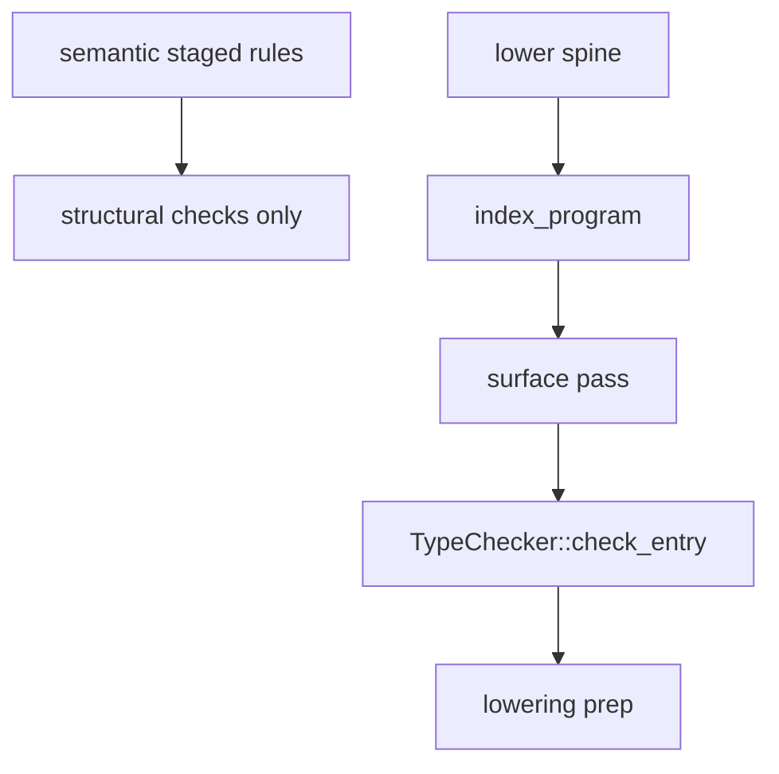

import SpecArticleChrome from '@beskid/beskid-ui/platform-spec/SpecArticleChrome.astro';

<SpecArticleChrome />

## Type-check authority

**Normative:** Expression and declaration **type checking** runs exactly once on the **lower spine**, observed as pipeline phase id **`lower.type_check`** (`LOWER_TYPE_CHECK` in `beskid_pipeline::phases`).

The reference compiler **must not** run a second full body-typing pass under **`semantic.type_check`**. That phase id is **not** authoritative for typed HIR or for `E12xx` type diagnostics.

Within **`lower.type_check`**, the reference compiler runs **`index_program`** first, then a **three-pass spine**:

1. **Surface** — build or load per-unit `UnitTypeSurface` values and merge for entry
2. **Check** — [`TypeChecker::check_entry`](compiler/crates/beskid_analysis/src/types/checker/entry.rs) body typing with constraint solving; write `node_types`
3. **Lowering prep** — `LoweringPrep` (`call_kinds`, `cast_intents`) keyed by `HirNodeId`

`TypeResult` assembly follows the three passes. See [Type-system pass contract](/platform-spec/compiler/semantic-pipeline/type-system-pass-contract/design-model/) for the full step list.

## What stays in semantic rules

Staged semantic rules (`SemanticPipelineRule` in `staged.rs`) **may** still emit diagnostics that mention types when the check is **structural** and does not require a completed `TypeResult`, for example:

- immutable assignment (`E1214`) in `staged/type_checking.rs`
- invalid `?` shape probes in `staged/error_handling.rs` where resolution alone suffices

Those checks **must not** duplicate full expression typing already performed at **`lower.type_check`**.

## Diagnostic collection

CLI analyze, LSP, and `prepare_compilation_diagnostics` **must** surface type errors by running the lower spine (or collecting `LowerResolveTypeError::Type` into semantic diagnostics via `emit_type_error`). Consumers **must** treat stable **`E12xx`** codes as the conformance surface regardless of whether the error was collected during semantic snapshot assembly or lower failure handling.

## Cross references

- End-to-end phase DAG: [Build pipeline / Stage ordering](/platform-spec/compiler/build-pipeline/stage-ordering/)
- Typed HIR contract: [Type-system pass contract](/platform-spec/compiler/semantic-pipeline/type-system-pass-contract/)
- Staged rule ordering (non-type): [Rules pipeline contract](/platform-spec/compiler/semantic-pipeline/rules-pipeline-contract/)
