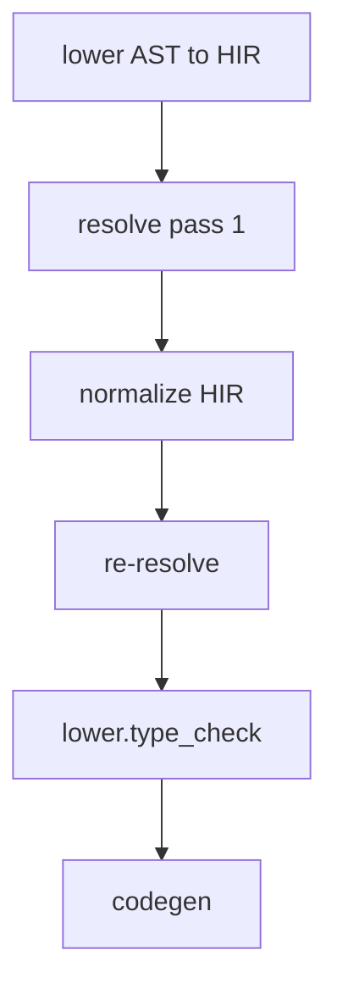

import SpecArticleChrome from '@beskid/beskid-ui/platform-spec/SpecArticleChrome.astro';

<SpecArticleChrome />

## What this covers

Order-of-operations for **`lower.type_check`** from normalized HIR through `TypeResult`. Entry points: [`typed_hir_from_lowered`](compiler/crates/beskid_analysis/src/services/lower.rs), [`type_entry`](compiler/crates/beskid_analysis/src/services/unit_ops.rs) / [`type_entry_gate`](compiler/crates/beskid_analysis/src/services/unit_ops.rs), [`prepare_compilation_with_db`](compiler/crates/beskid_queries/src/entry.rs).

## Spine placement

Type checking runs **after** HIR normalize and **after** the post-normalize resolution pass on the lower spine. It runs **before** codegen lowering.



## `lower.type_check` algorithm (normative)

### Step 0 — Index HIR nodes

```text
index_program(&mut hir)
```

Assign dense `HirNodeId` values to every typable `Spanned<T>` in pre-order. Nodes created with `Spanned::new` start at `HirNodeId::INVALID` until this step.

### Step 1 — Surface pass

For each unit in the typing scope (entry plus dependencies per policy):

1. If a valid cached surface exists (`unit_type_surface_tracked`), load `Arc<UnitTypeSurface>`.
2. Otherwise run `build_unit_type_surface(hir, resolution)` — one walk collecting struct fields, enum variants, function and method signatures, generic arity, and contract exports.
3. Store the surface in `TypeResult.unit_surfaces` keyed by source path.

Merge dependency surfaces into `MergedTypeEnv` for entry body checking. Cross-unit data flows through **`ItemId`** keys on surfaces, not `HirNodeId`.

### Step 2 — Check pass

Run `TypeChecker::check_entry` (or per-unit `type_unit_body` under **`FullClosure`**) against merged surfaces:

1. Walk statements and expressions; for each node, record `node_types[node.id] = TypeId`.
2. At inference sites (`let`, lambdas, generic calls), push constraints into a `ConstraintSet` and call `solve_constraints`.
3. On solver failure or ambiguity, collect `TypeError` (including **E1202**).
4. Populate `local_types`, item signature maps, and ordered struct/enum layouts on the entry result.

The check pass **must not** write span-keyed expression type maps.

### Step 3 — Lowering prep pass

Run `LoweringPrep::run` on the typed tree:

1. Read resolved types from `node_types`.
2. Record `call_kinds[node.id]` for each call expression.
3. Append `CastIntent { node_id, span, from, to, ... }` for casts codegen must honor.

No inference occurs in this pass.

### Step 4 — Assemble and return

On success, return `(hir, resolution, TypeResult { node_types, unit_surfaces, lowering, ... })`. On any `TypeError`, fail with `LowerResolveTypeError::Type`.

## Policy-specific flows

### `EntryOnly` (IDE fast path)


- Dependency units contribute **surfaces only** via Salsa cache.
- Entry unit body is fully checked; dependency bodies are not re-walked.
- Used when stale typed prepare can still serve codegen/LSP with refreshed entry types.

### `FullClosure` (build / executable prepare)


- Each dependency HIR unit in the assembly closure may be body-checked.
- Surfaces still cached per unit; invalidation evicts dependent caches on edit.

## Incremental invalidation

When a source unit changes:

1. Salsa invalidates that unit's parse, resolution, and type surface tokens.
2. Reverse-deps BFS over `unit_imports` evicts surfaces for importers.
3. Next prepare re-runs surface (and optionally body) passes only for dirty units.

**Normative:** Prefetch typing **must not** read dependency files from disk outside the Salsa unit graph.

## Consumer read order

Codegen and IDE queries **must** consult `TypeResult` in this order:

1. `node_type(expr.id)` for expression types
2. `lowering.call_kind_at(expr.id)` for dispatch
3. `lowering.cast_intents_for_node(expr.id)` for casts
4. Item-keyed maps (`function_signatures`, `struct_fields_ordered`) for declaration metadata

Structural re-inference at codegen time (for example `infer_expr_type` fallbacks) is **forbidden**.
