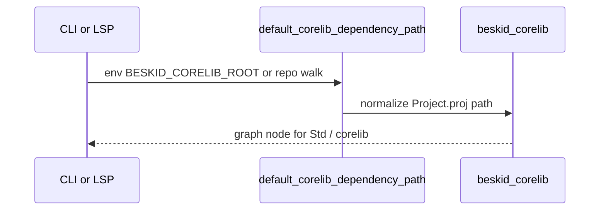

import SpecArticleChrome from '@beskid/docs-ui/platform-spec/SpecArticleChrome.astro';

<SpecArticleChrome />

## Local discovery flow

1. Tool starts project resolution.
2. `default_corelib_dependency_path` checks `BESKID_CORELIB_ROOT`, then `discover_repo_corelib_root` walking ancestors for `compiler/corelib/beskid_corelib`.
3. If CLI startup runs `ensure_corelib_ready`, bundled template materialization may populate install dir before step 2.
4. Aggregate manifest pulls workspace members into the compile plan.

## CI publish flow

1. Build / verify corelib workspace in `compiler` CI.
2. `beskid doc` (when enabled) writes `.beskid/docs/api.json` + markdown.
3. `beskid pckg pack` on `beskid_corelib/Project.proj` with publisher credentials.
4. pckg server validates artifact (`PackageArtifactValidator`) and ingests docs for the package browser.
5. Consumers `beskid fetch` pinned versions into `.beskid/packages/` recorded in `Project.lock`.

## Shard cycle avoidance

When resolving manifests under `compiler/corelib/packages/*`, `is_corelib_workspace_shard_manifest` suppresses implicit `Std` back-edges to the aggregate package to prevent `beskid_corelib → shard → beskid_corelib` cycles.

## Algorithm notes

- Trace one `beskid_corelib` compile in tests before editing resolver edge cases.
- Pack and discovery share `parse_manifest` — manifest errors surface identically in CLI and pack.
- Registry listing uses structured **`api.json`** as the docs UI contract when published.

## Tests

`compiler/crates/beskid_tests/src/projects/corelib/` (compile, layout, mod helpers).
