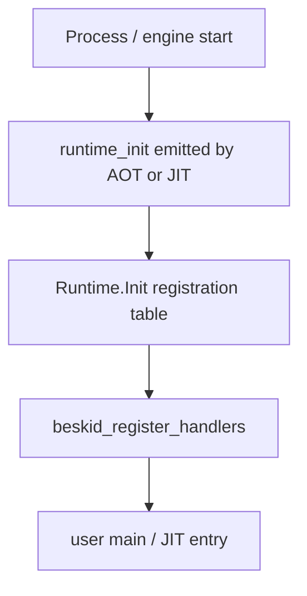

import SpecArticleChrome from '@beskid/beskid-ui/platform-spec/SpecArticleChrome.astro';

<SpecArticleChrome />

## Purpose

ABI v3 moves **dispatch tag assignment**, **envelope types**, and **runtime status codes** into corelib Beskid sources. The Rust runtime becomes a substrate that executes registered handlers — not the authority for symbolic runtime metadata.

## Corelib modules

| Module | Role |
| --- | --- |
| **`Runtime.Abi`** | Envelope layouts, dispatch tag constants, status codes — single source for domain packages |
| **`Runtime.Init`** | Builds compile-time handler table; calls `__beskid_register_handlers` at process start |
| Domain shims | Concurrency, IO, and foundation wrappers use `[Runtime]` attributes on `__*` entrypoints |

## `[Runtime]` attribute

Corelib functions that back soft dispatch **may** declare:

```beskid
[Runtime(DispatchTag: 0, Returns: Usize)]
pub i64 __str_len(BeskidStr s) { ... }
```

Analysis merges attributed entries with manifest rows. Codegen routes calls through `interop_dispatch_*` using the declared return group.

## Init hook flow



Registration **must** complete before user static init ([D-CORE-COMP-0010](/platform-spec/core-library/compiler-integration/corelib-injection-and-resolution/adr/0010-runtime-registration-authority/)).

## Status code migration

Concurrency and IO modules import status constants from **`Runtime.Abi`** instead of duplicating Rust literals in `beskid_runtime::status`. Contract tests assert corelib constants match runtime behavior.

## Related topics

- [Runtime manifest](/platform-spec/language-meta/interop/rust-abi-profile/runtime-manifest/) — manifest schema
- [Kernel and dispatch](/platform-spec/language-meta/interop/rust-abi-profile/kernel-and-dispatch/) — call paths
- [Handler registration init order](/platform-spec/execution/abi-and-host/extern-dispatch-and-policy/adr/0007-handler-registration-init-order/)
