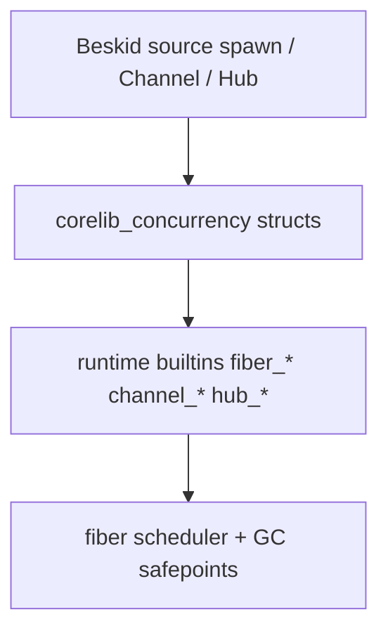

import SpecPageHeader from '@beskid/docs-ui/platform-spec/SpecPageHeader.astro';
import DomainTiles from '@beskid/docs-ui/platform-spec/DomainTiles.astro';
import SpecSection from '@beskid/docs-ui/platform-spec/SpecSection.astro';

<SpecPageHeader status="Standard" ownerName="Piotr Mikstacki" ownerEmail="pmikstacki@cybernomad.it" submitterName="Piotr Mikstacki" submitterEmail="pmikstacki@cybernomad.it" />

<SpecSection title="Layer diagram" id="layer-diagram">

The package is a **thin wrapper** layer only — no duplicate channel abstractions or async state machines.

</SpecSection>

<SpecSection title="What this feature specifies" id="what-this-feature-specifies">
Normative **corelib** shapes for cooperative concurrency: `Fiber<T>`, `Channel<T>`, homogeneous `Hub<T>`, `Mutex`, and `WaitGroup` as thin wrappers over stable runtime builtins. `spawn` lowering returns a move-only fiber handle with `OnCancelled` on the handle; channel and join failures use `Result` / `Option`, not panic.
</SpecSection>

<SpecSection title="Implementation anchors" id="implementation-anchors">
- Workspace package `compiler/corelib/packages/concurrency/` (`corelib_concurrency`)
- Runtime symbols: `compiler/crates/beskid_abi/src/symbols.rs`, `BUILTIN_SPECS`
- Corelib tests: `compiler/corelib/beskid_corelib/tests/corelib_tests/src/concurrency/`
- Runtime integration: `compiler/crates/beskid_runtime/tests/concurrency.rs` plus `compiler/crates/beskid_tests/src/runtime/jit.rs` spawn smoke coverage
</SpecSection>

<SpecSection title="Contract statement" id="contract-statement">
The `corelib_concurrency` workspace package provides the only supported user-facing API for cooperative fibers and channel communication. Public types are **structs** whose methods call **stable runtime builtins** (`fiber_*`, `channel_*`, `hub_*`, `mutex_*`, `wait_group_*`). The package **must not** introduce secondary abstraction layers (no builder stacks, no implicit async state machines, no duplicated channel interfaces).

All fiber operations that can fail **must** return `Core.Results.Result` (or `Option` where absence is ordinary). **Panics are not** the error path for channel or join failures.
</SpecSection>

<SpecSection title="Inputs and outputs" id="inputs-and-outputs">
| Surface | Role |
| --- | --- |
| `Fiber<T>` | Opaque handle wrapping `fiber_*` builtins; `T` is the spawn entry return type |
| `Channel<T>` | **Unbounded by default**; `ChannelOptions.Bounded(n)` for bounded queues |
| `Hub<T>` | Homogeneous multichannel **WaitReceive** (round-robin); unlike types use `Channel<HubMessage>` or multiple hubs |
| `Mutex` | Mutual exclusion between fibers on shared state |
| `WaitGroup` | Fork–join counter for batches of fibers |
| `Concurrency.Yield()` | Cooperative reschedule (`fiber_yield`) |
| `Concurrency.NowMillis()` | Monotonic milliseconds (`fiber_now_millis` / clock builtin) |
| `Concurrency.Spawn` | Used by lowering of `spawn`; returns `Fiber<T>` with **OnCancelled** on handle |
| `Fiber.Join` | `Result<T, FiberError>` |
| `Fiber.Detach` | Fire-and-forget; unjoined panic still aborts process unless recovered at runtime policy |
| `Fiber.Cancel` | Sets cancel flag; runs child `event OnCancelled()`; **Join** → `FiberError::Cancelled` |
</SpecSection>

<SpecSection title="State model" id="state-model">
- `Fiber<T>` — runtime handle + metadata (id, cancellation flag). Not copyable unless spec later allows handle duplication; **move-only** preferred.
- `Channel<T>` — holds runtime queue id; **Close** marks writer end closed; **Receive** after drain returns `ChannelError::Closed` in `Result`.
- `Hub` — registered set of channel endpoints with cached readiness index updated by runtime on send/receive.
- Phase A (see scheduler spec): many fibers, **single GC mutator thread** documented; Phase B adds parallel mutators without API break.
</SpecSection>

<SpecSection title="Algorithms and flow" id="algorithms-and-flow">
1. `spawn entry` lowers to `fiber_spawn_with_cancel_slot(entry, env, onCancelledSlot)`; parent gets a `Fiber<T>` backed by the runtime `i64` fiber id.
2. **Send** — if queue full, **park current fiber** (not OS thread); on success establishes happens-before edge to receiver.
3. **Receive** — if empty and open, park; if closed and empty, return `Result::Err(Closed)`.
4. **TrySend** / **TryReceive** — non-blocking; `Option` for empty/full.
5. **Hub.WaitReceive** — runtime waits until any registered channel can satisfy Receive; returns which member completed.
6. Blocking **syscall** paths in `System.Syscall` **should** park the calling fiber and delegate blocking work to the thread pool (runtime), not stall the whole scheduler.
</SpecSection>

<SpecSection title="Edge cases and errors" id="edge-cases-and-errors">
- **Send** after **Close** → `Result::Err(ChannelError::Closed)` (no panic).
- **Cancel** on joined fiber → `FiberError::Cancelled` on **Join**.
- **Detach** child panic → process abort after diagnostic unless runtime policy adds domain recovery later.
- Fibers **must not** share pointers to another fiber's stack; **Channel** is the **only** approved cross-fiber communication (language + memory model).
</SpecSection>

<SpecSection title="Compatibility and versioning" id="compatibility-and-versioning">
New builtins require `beskid_runtime_abi_version` bump and entries in `BUILTIN_SPECS` / `define_builtins!`. Deprecated v0.1 `rt_yield` / `rt_now_millis` (`sched` feature) are superseded by `fiber_yield` and monotonic clock builtins—remove legacy doc references to async/await.
</SpecSection>

<SpecSection title="Security and performance notes" id="security-and-performance-notes">
- Default fiber stack: **64 KiB**, growable cap **8 MiB** (runtime).
- Unbounded channels are opt-in; documentation **must** warn about memory growth.
- **Hub** registration count should be bounded in UI scenarios (console) to avoid linear scans on hot paths.
</SpecSection>

<SpecSection title="Examples" id="examples">
See **[examples](./examples/)** article: spawn + **Join**, bounded **Channel**, **Hub** for stdin/resize multiplexing sketch.
</SpecSection>

<SpecSection title="Verification and traceability" id="verification-and-traceability">
- Corelib compile tests under `compiler/corelib/beskid_corelib/tests/corelib_tests/src/concurrency/`
- Runtime integration: canonical primitive coverage in `compiler/crates/beskid_runtime/tests/concurrency.rs`; JIT smoke in `compiler/crates/beskid_tests/src/runtime/jit.rs`
- Conformance: bounded/closed **Channel**, **Cancel**, **Hub** readiness ordering, **Mutex**, **WaitGroup**, and syscall parking
</SpecSection>

<SpecSection title="Decisions" id="decisions">
No open decisions. Closed choices are normative ADRs under **`adr/`** (`D-CORE-CONC-0001` … `D-CORE-CONC-0014`); use the reader **ADRs** tab for expandable detail. Legacy [decisions record](./decisions-record/) is a migration index only.
</SpecSection>

<SpecSection title="Related features" id="related-features">
- **[System.Threading](/platform-spec/core-library/concurrency/system-threading/)** — OS threads (preemptive), not fibers
- **[Console terminal events](/platform-spec/core-library/terminal-and-console/console-terminal-events/)** — delivers via **Channel**
</SpecSection>

<DomainTiles pathPrefix="platform-spec/core-library/concurrency/concurrency-package" heading="Articles" />
