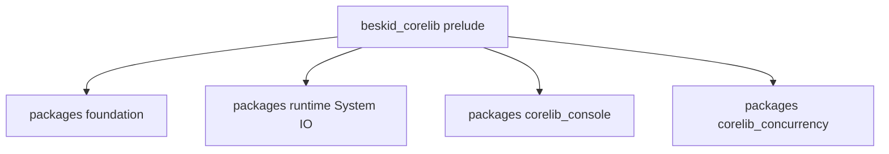

import SpecArticleChrome from '@beskid/docs-ui/platform-spec/SpecArticleChrome.astro';

<SpecArticleChrome />

## Package and module layout

## Primary actors

- **Authors** — import via `use` and prelude; depend on stable module paths documented here.
- **Compiler** — resolves `corelib` package identity and injects the workspace package (see [Corelib injection](/platform-spec/core-library/compiler-integration/corelib-injection-and-resolution/)).
- **Conformance** — `beskid_tests` corelib layout/compile/ABI fixtures pin surface shape across releases.

## Prelude exports (v0.2)

The aggregate prelude re-exports **`System.Input`**, **`System.Output`**, **`System.Error`**, and **`Console`** (from `corelib_console`). **`System.IO`** is removed; use stream-specific modules instead.

## Concrete crate anchors

- Public module and prelude sources under `compiler/corelib/beskid_corelib`
- Workspace packages under `compiler/corelib/packages/` (`runtime`, `foundation`, `console`, `compiler-sdk`)
- Shape-sensitive compile tests in `compiler/crates/beskid_tests/src/projects/corelib/compile.rs`
- Layout and compatibility checks in `compiler/crates/beskid_tests/src/projects/corelib/layout.rs`
- Runtime-facing call coverage in `compiler/crates/beskid_tests/src/abi/contracts.rs`
