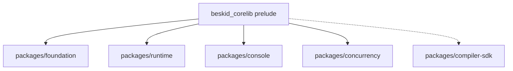

import SpecArticleChrome from '@beskid/docs-ui/platform-spec/SpecArticleChrome.astro';

<SpecArticleChrome />

## The three tiers

| Tier | Doc directive | Audience | Compatibility |
| --- | --- | --- | --- |
| **Standard** | `@tier(standard)` (alias `Tier1`) | Application authors | Signature stable for the full `v0.x` line; breaking changes require a major bump and a normative ADR |
| **Supported** | `@tier(supported)` (alias `Tier2`, default when no directive resolves) | Application and library authors | Signature stable within a `v0.x` minor; behavior may evolve with deprecations |
| **Unstable** | `@tier(unstable)` (alias `Tier3`) | Compiler, tooling, opt-in experiments | Signature may change between minors without notice |

## Workspace package layout

The prelude only re-exports Tier 1 modules. `packages/compiler-sdk` is reached through explicit `use` statements because most of it is Tier 3 by design (the syntax mirror surface is generated and evolves with the compiler).

## Resolution cascade

For any public `ApiDocItem` the resolver walks this ordered cascade and stops at the first match:

1. **Item directive** — `///` doc comment on the item carries `@tier(...)`.
2. **Parent module directive** — the immediate parent module has a `@tier(...)` directive (members inherit unless overridden).
3. **Package default** — the package's `Project.proj` declares a default tier (reserved for future use; not required today).
4. **Workspace default** — currently `supported`; the resolver leaves `tier: None` so consumers apply this default without rewriting the field.

## Prelude exposure rules

- The aggregate `beskid_corelib` prelude SHALL only re-export modules whose effective tier (cascade resolution) is **Standard**.
- Tier 2 / Tier 3 modules MUST be reached through explicit `use Pkg.Module;` imports.
- The prelude validator inspects the `pub mod ...;` list and fails the publish job if it discovers a non-Tier-1 re-export.

## Primary actors

- **Authors** — annotate corelib modules with `@tier(...)` and import explicitly when crossing tier boundaries.
- **Compiler** — `beskid_analysis::doc::api_tier::resolve_item_tiers` applies the cascade; `beskid doc` emits the resolved value into `api.json`.
- **Conformance** — `beskid_tests::projects::corelib::layout` checks every collection and System module carries a `@tier(...)` directive and that the `api.json` round-trip preserves the field.
- **Consumers** — IDE, registry, and lints read the `tier` field from `api.json` to badge symbols and warn on Tier 3 usage outside opt-in contexts.

## Concrete crate anchors

- Resolver: `compiler/crates/beskid_analysis/src/doc/api_tier.rs`
- Snapshot field: `compiler/crates/beskid_analysis/src/doc/api_snapshot.rs`
- CLI integration: `compiler/crates/beskid_cli/src/commands/doc.rs`
- Tier-tagged sources: `compiler/corelib/packages/foundation/src/Collections/`, `compiler/corelib/packages/runtime/src/System/`
- Layout / round-trip tests: `compiler/crates/beskid_tests/src/projects/corelib/layout.rs`
