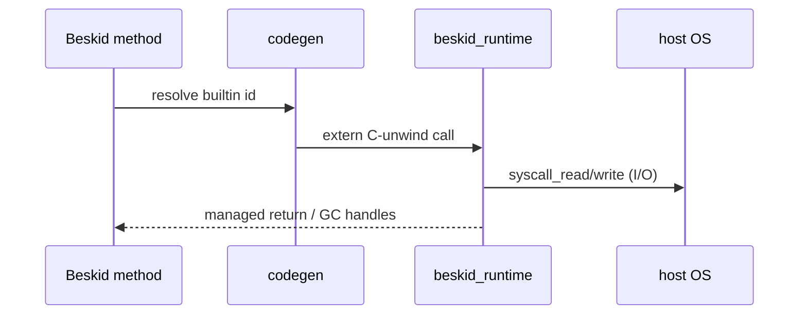

import SpecArticleChrome from '@beskid/beskid-ui/platform-spec/SpecArticleChrome.astro';

<SpecArticleChrome />

## Call lowering flow

1. Semantic resolution binds call to a known runtime builtin or inlined fast path.
2. Codegen emits ABI-stable symbol reference from `beskid_abi` tables.
3. JIT (`beskid_engine`) or AOT (`beskid_aot`) links runtime object providing the symbol.
4. Builtin implementation enforces GC safepoints, panic translation, and I/O error mapping.

## I/O split algorithm

- **`Core.Input`** — read paths funnel through `syscall_read` helpers in `panic_io` module.
- **`Core.Output` / `Core.Error`** — write paths use `syscall_write` with distinct handles where the host distinguishes stderr.
- **Console package** — layers formatting/ANSI on top without redefining syscall contracts.

## Fiber and GC interaction

Fiber builtins (`fiber_spawn`, `fiber_yield`, …) and GC builtins (`gc_collect`, write barriers) share the same registration hub (`hub` module). Corelib wrappers **must not** reimplement scheduler logic in Beskid-only code paths for normative behavior.

## Verification flow

ABI contract tests compare declared signatures against runtime exports before release tags ship.

## Tests

`compiler/crates/beskid_tests/src/abi/contracts.rs` is the primary gate; extend when adding builtin surfaces.
