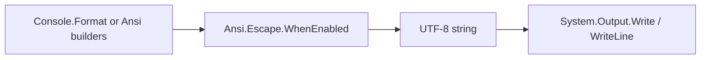

import SpecArticleChrome from '@beskid/docs-ui/platform-spec/SpecArticleChrome.astro';

<SpecArticleChrome />

## Purpose

Describe how escape bytes are **composed**, **gated** by capabilities, and **written** to stdout.

## Canonical references

- Tables: [design model](./design-model/)
- Requirements: [contracts and edge cases](./contracts-and-edge-cases/)
- Write path: [Console I/O streams / flow and algorithm](/platform-spec/core-library/terminal-and-console/console-io-streams/flow-and-algorithm/)

## Detailed behavior

### Emission pipeline

1. **Compose** — Fluent builders (`Cursor`, `Erase`, `Sgr`) accumulate parameter strings; `JoinArgs` inserts `;` between SGR parameters without trailing separators.
2. **Frame** — `Csi` / `PrivateMode` / `DecSaveCursor` / `OscSequence` produce raw escape strings (ungated).
3. **Gate** — `WhenEnabled` returns `""` or the sequence based on `ShouldEmitAnsi()` (stdout TTY + color policy).
4. **Deliver** — Higher layers (`Console.FormatLine`, controls renderers) pass the final string to [Console I/O streams](/platform-spec/core-library/terminal-and-console/console-io-streams/) helpers.

### SGR color downgrade algorithm

When `SgrBuilder.FgRgb` / `BgRgb` runs:

1. `Capabilities.ProbeStdout()` reads TTY and environment flags.
2. `EffectiveColorModel` selects **TrueColor**, **Indexed256**, or **Basic16** (or forces basic when color is stripped).
3. Parameter bytes are chosen:
   - TrueColor → `38;2;r;g;b` / `48;2;r;g;b`
   - Indexed256 → `38;5;n` / `48;5;n` via `RgbTo256Index`
   - Basic → nearest `30–37` / `40–47` via `RgbToBasicForeground` / `RgbToBasicBackground`
4. `IntoPrefix` calls `EmitCsi(openArgs, "m")`; `ApplyTo` appends text and `ResetSuffix` (`ESC[0m` gated).

### Builder concatenation

`Ansi.Cursor.CursorBuilder` appends fragments in call order, then `IntoSequence` applies a **single** gate at the end. Multiple CSI operations in one string are valid because terminals process them left-to-right.

### Test-only ungated paths

## Verification

`CapabilitiesTests.bd` asserts empty gated output when ANSI disabled; golden tests use ungated `CsiSequence` for framing only.

## Related topics

- [Examples](./examples/)
- [Console controls](/platform-spec/core-library/terminal-and-console/console-controls/flow-and-algorithm/) — frame save/restore around render

Conformance tests call `CsiSequence` and `PrivateMode` directly to assert framing without depending on TTY state. Production markup **must** use `EmitCsi` or builders that call `WhenEnabled`.
