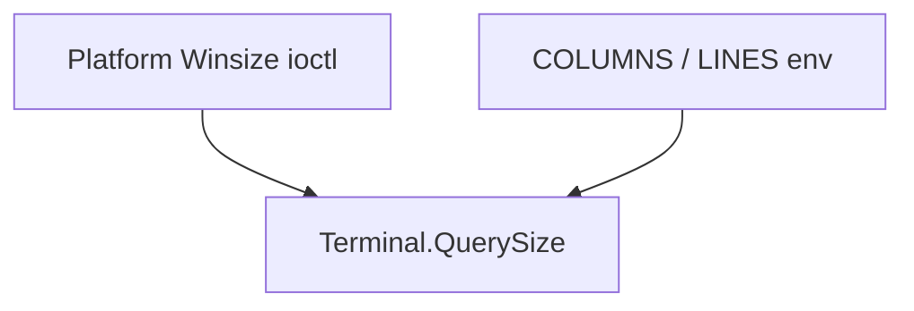

import SpecArticleChrome from '@beskid/beskid-ui/platform-spec/SpecArticleChrome.astro';

<SpecArticleChrome />

## Purpose

Document **design model** for the **Console Terminal Events** feature: role-specific normative detail beyond the feature hub.

## Canonical references

- Feature hub: [Console Terminal Events](/platform-spec/core-library/terminal-and-console/console-terminal-events/)
- Sibling articles in this bundle (design model, contracts, flow, examples, verification)

## Detailed behavior

### `ConsoleMessage`

| Variant | Payload | Use |
| --- | --- | --- |
| `Resize(ConsoleSize)` | columns/rows | Terminal geometry changed |
| (tick-related) | — | Integrated with `Console.RunTick` polling |

Messages flow on an **unbounded** `Channel<ConsoleMessage>` created by `Console.MessagesChannel()` unless callers supply their own channel.

### `OnResize` hub

Same-fiber `event OnResize(ConsoleSize)` with cached `lastSize`. Distinct from `Concurrency.Hub` (channel multiplexing). Use when resize handlers must run on the UI fiber without cross-fiber `Send`.

### Size probing stack

ANSI screen modes are unrelated to size events; see [ANSI escape model](/platform-spec/core-library/terminal-and-console/ansi-escape-model/).

## Verification

See the verification and traceability article in this bundle and `compiler/corelib/beskid_corelib/tests/corelib_tests/src/console/`.

## Related topics

- Parent [feature hub](/platform-spec/core-library/terminal-and-console/console-terminal-events/) and [Terminal and console area](/platform-spec/core-library/terminal-and-console/)
